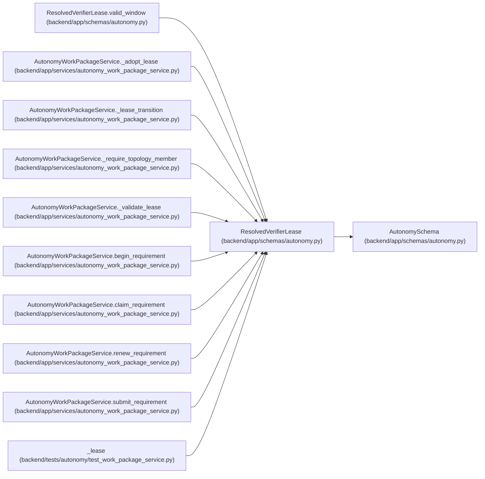

# ResolvedVerifierLease

**Location:** `backend/app/schemas/autonomy.py:63`
**Kind:** Pydantic model
**Bases:** `AutonomySchema`
**Module:** [schemas_autonomy](../modules/schemas_autonomy.md)

## Description

Result of resolving an external signed action lease before service entry.

## Validators

| Method | Scope | Fields | Mode | Options |
|--------|-------|--------|------|---------|
| `valid_window` | model | — | after | — |

## Attributes

| Name | Type | Wire name | Required | Nullable | Default | Constraints | Examples | Description |
|------|------|-----------|----------|----------|---------|-------------|-------------|----------|
| `lease_digest` | `str` | `lease_digest` | Yes | No | — | pattern=unknown (SHA256_PATTERN) | — | — |
| `task_id` | `str` | `task_id` | Yes | No | — | pattern=unknown (IDENTIFIER_PATTERN) | — | — |
| `stage_id` | `str` | `stage_id` | Yes | No | — | pattern=unknown (IDENTIFIER_PATTERN) | — | — |
| `action` | `Literal['verification-claim', 'verification-begin', 'verification-renew', 'verification-submit']` | `action` | Yes | No | — | — | — | — |
| `actor_logical_key` | `str` | `actor_logical_key` | Yes | No | — | pattern=unknown (IDENTIFIER_PATTERN) | — | — |
| `actor_id` | `int` | `actor_id` | Yes | No | — | ge=1 | — | — |
| `topology_revision` | `int` | `topology_revision` | Yes | No | — | ge=1 | — | — |
| `attempt_start_digest` | `str` | `attempt_start_digest` | Yes | No | — | pattern=unknown (SHA256_PATTERN) | — | — |
| `issued_at` | `datetime` | `issued_at` | Yes | No | — | — | — | — |
| `expires_at` | `datetime` | `expires_at` | Yes | No | — | — | — | — |

## Methods

| Method | Signature | Decorators | Description |
|--------|-----------|------------|-------------|
| `valid_window` | `() -> 'ResolvedVerifierLease'` | `@model_validator(mode='after')` | — |

## Relationships

<!-- Auto-generated relationship summary. Do not edit by hand. -->

### Summary

| Module | Methods | Attributes |
|---|---:|---|
| [schemas_autonomy](../modules/schemas_autonomy.md) | 1 | `action`, `actor_id`, `actor_logical_key`, `attempt_start_digest`, `expires_at`, `issued_at`, `lease_digest`, `stage_id`, `task_id`, `topology_revision` |

### Structure

| Kind | Entity | Module |
|---|---|---|
| Base | `AutonomySchema` | [schemas_autonomy](../modules/schemas_autonomy.md) |

### References

| Reference | Kind | Source | Call sites |
|---|---|---|---:|
| `ResolvedVerifierLease.valid_window` | type_reference | [schemas_autonomy](../modules/schemas_autonomy.md) | — |
| `AutonomyWorkPackageService._adopt_lease` | type_reference | [autonomy_work_package_service](../modules/autonomy_work_package_service.md) | — |
| `AutonomyWorkPackageService._lease_transition` | type_reference | [autonomy_work_package_service](../modules/autonomy_work_package_service.md) | — |
| `AutonomyWorkPackageService._require_topology_member` | type_reference | [autonomy_work_package_service](../modules/autonomy_work_package_service.md) | — |
| `AutonomyWorkPackageService._validate_lease` | type_reference | [autonomy_work_package_service](../modules/autonomy_work_package_service.md) | — |
| `AutonomyWorkPackageService.begin_requirement` | type_reference | [autonomy_work_package_service](../modules/autonomy_work_package_service.md) | — |
| `AutonomyWorkPackageService.claim_requirement` | type_reference | [autonomy_work_package_service](../modules/autonomy_work_package_service.md) | — |
| `AutonomyWorkPackageService.renew_requirement` | type_reference | [autonomy_work_package_service](../modules/autonomy_work_package_service.md) | — |
| `AutonomyWorkPackageService.submit_requirement` | type_reference | [autonomy_work_package_service](../modules/autonomy_work_package_service.md) | — |
| `_lease` | call | [test_work_package_service](../modules/test_work_package_service.md) | 1 |
| `_lease` | type_reference | [test_work_package_service](../modules/test_work_package_service.md) | — |
