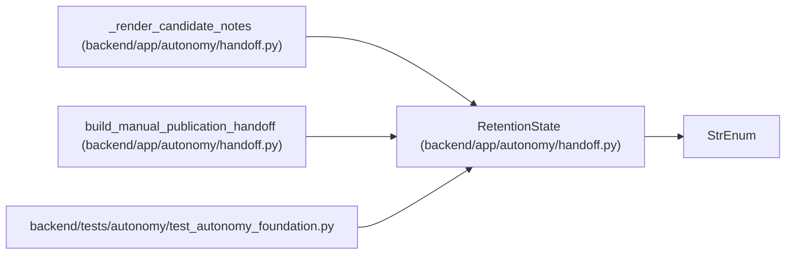

# RetentionState

**Location:** `backend/app/autonomy/handoff.py:42`
**Kind:** Enum
**Bases:** `StrEnum`
**Module:** [handoff](../modules/handoff.md)

## Description

_Auto-generated from `RetentionState` in `backend/app/autonomy/handoff.py`._

## Attributes

| Name | Declared value | Description |
|------|-------|-------------|
| `RETAINED_NOT_DUE` | `'retained-not-due'` | — |
| `DISPOSED` | `'disposed'` | — |
| `OVERDUE` | `'overdue'` | — |

## Methods

*No public methods. Inherits from base classes.*

## Relationships

<!-- Auto-generated relationship summary. Do not edit by hand. -->

### Summary

| Module | Methods | Attributes |
|---|---:|---|
| [handoff](../modules/handoff.md) | 0 | `DISPOSED`, `OVERDUE`, `RETAINED_NOT_DUE` |

### Structure

| Kind | Entity | Module |
|---|---|---|
| Base | `StrEnum` | — |

### References

| Reference | Kind | Source | Call sites |
|---|---|---|---:|
| `_render_candidate_notes` | type_reference | [handoff](../modules/handoff.md) | — |
| `build_manual_publication_handoff` | type_reference | [handoff](../modules/handoff.md) | — |
| `test_autonomy_foundation` | import | [test_autonomy_foundation](../modules/test_autonomy_foundation.md) | — |
