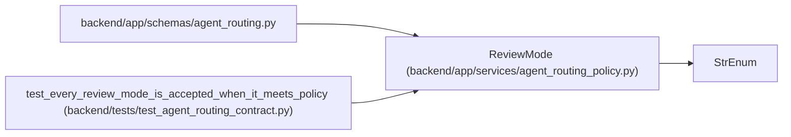

# ReviewMode

**Location:** `backend/app/services/agent_routing_policy.py:151`
**Kind:** Enum
**Bases:** `StrEnum`
**Module:** [agent_routing_policy](../modules/agent_routing_policy.md)

## Description

Closed review modes ordered by increasing independence requirements.

## Attributes

| Name | Declared value | Description |
|------|-------|-------------|
| `NONE` | `'none'` | — |
| `STANDARD` | `'standard'` | — |
| `INDEPENDENT` | `'independent'` | — |
| `SPECIALIST_INDEPENDENT` | `'specialist-independent'` | — |

## Methods

*No public methods. Inherits from base classes.*

## Relationships

<!-- Auto-generated relationship summary. Do not edit by hand. -->

### Summary

| Module | Methods | Attributes |
|---|---:|---|
| [agent_routing_policy](../modules/agent_routing_policy.md) | 0 | `INDEPENDENT`, `NONE`, `SPECIALIST_INDEPENDENT`, `STANDARD` |

### Structure

| Kind | Entity | Module |
|---|---|---|
| Base | `StrEnum` | — |

### References

| Reference | Kind | Source | Call sites |
|---|---|---|---:|
| `agent_routing` | import | [agent_routing](../modules/agent_routing.md) | — |
| `test_every_review_mode_is_accepted_when_it_meets_policy` | type_reference | [test_agent_routing_contract](../modules/test_agent_routing_contract.md) | — |
