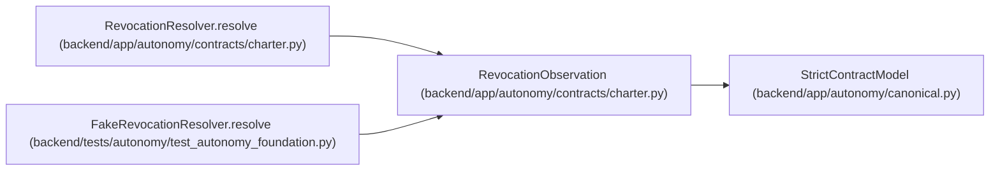

# RevocationObservation

**Location:** `backend/app/autonomy/contracts/charter.py:309`
**Kind:** Pydantic model
**Bases:** `StrictContractModel`
**Module:** [charter](../modules/charter.md)

## Description

Source-derived revocation result; never a caller-authored bare Boolean.

## Validators

| Method | Scope | Fields | Mode | Options |
|--------|-------|--------|------|---------|
| `aware_observation` | field | observed_at | after | — |

## Attributes

| Name | Type | Wire name | Required | Nullable | Default | Constraints | Examples | Description |
|------|------|-----------|----------|----------|---------|-------------|-------------|----------|
| `charter_id` | `str` | `charter_id` | Yes | No | — | pattern=unknown (IDENTIFIER_PATTERN) | — | — |
| `state` | `Literal['active', 'revoked', 'unknown']` | `state` | Yes | No | — | — | — | — |
| `observed_at` | `datetime` | `observed_at` | Yes | No | — | — | — | — |
| `source_ref` | `str` | `source_ref` | Yes | No | — | max_length=1024; pattern=unknown (OPAQUE_REF_PATTERN) | — | — |
| `source_generation` | `str` | `source_generation` | Yes | No | — | min_length=1; max_length=255 | — | — |
| `source_receipt_digest` | `str` | `source_receipt_digest` | Yes | No | — | pattern=unknown (SHA256_PATTERN) | — | — |

## Methods

| Method | Signature | Decorators | Description |
|--------|-----------|------------|-------------|
| `aware_observation` | `(value: datetime) -> datetime` | `@field_validator('observed_at')`, `@classmethod` | — |

## Relationships

<!-- Auto-generated relationship summary. Do not edit by hand. -->

### Summary

| Module | Methods | Attributes |
|---|---:|---|
| [charter](../modules/charter.md) | 1 | `charter_id`, `observed_at`, `source_generation`, `source_receipt_digest`, `source_ref`, `state` |

### Structure

| Kind | Entity | Module |
|---|---|---|
| Base | `StrictContractModel` | [autonomy_canonical](../modules/autonomy_canonical.md) |

### References

| Reference | Kind | Source | Call sites |
|---|---|---|---:|
| `RevocationResolver.resolve` | type_reference | [charter](../modules/charter.md) | — |
| `FakeRevocationResolver.resolve` | call | [test_autonomy_foundation](../modules/test_autonomy_foundation.md) | 1 |
| `FakeRevocationResolver.resolve` | type_reference | [test_autonomy_foundation](../modules/test_autonomy_foundation.md) | — |
