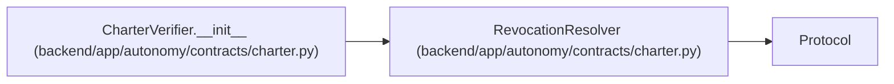

# RevocationResolver

**Location:** `backend/app/autonomy/contracts/charter.py:327`
**Kind:** Class
**Bases:** `Protocol`
**Module:** [charter](../modules/charter.md)

**Decorators:** `@runtime_checkable`

## Description

_Auto-generated from `RevocationResolver` in `backend/app/autonomy/contracts/charter.py`._

## Attributes

*No annotated attributes found.*

## Methods

| Method | Signature | Decorators | Description |
|--------|-----------|------------|-------------|
| `resolve` | `(*, charter_id: str, source_ref: str) -> RevocationObservation` | — | — |

## Relationships

<!-- Auto-generated relationship summary. Do not edit by hand. -->

### Summary

| Module | Methods | Attributes |
|---|---:|---|
| [charter](../modules/charter.md) | 1 | — |

### Structure

| Kind | Entity | Module |
|---|---|---|
| Base | `Protocol` | — |

### References

| Reference | Kind | Source | Call sites |
|---|---|---|---:|
| `CharterVerifier.__init__` | type_reference | [charter](../modules/charter.md) | — |
