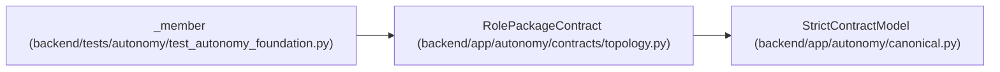

# RolePackageContract

**Location:** `backend/app/autonomy/contracts/topology.py:118`
**Kind:** Pydantic model
**Bases:** `StrictContractModel`
**Module:** [topology](../modules/topology.md)

## Description

_Auto-generated from `RolePackageContract` in `backend/app/autonomy/contracts/topology.py`._

## Attributes

| Name | Type | Wire name | Required | Nullable | Default | Constraints | Examples | Description |
|------|------|-----------|----------|----------|---------|-------------|-------------|----------|
| `package_key` | `str` | `package_key` | Yes | No | — | pattern=unknown (LOGICAL_KEY_PATTERN) | — | — |
| `version` | `str` | `version` | Yes | No | — | min_length=1; max_length=128 | — | — |
| `checksum_sha256` | `str` | `checksum_sha256` | Yes | No | — | pattern=unknown (SHA256_PATTERN) | — | — |

## Methods

*No public methods. Inherits from base classes.*

## Relationships

<!-- Auto-generated relationship summary. Do not edit by hand. -->

### Summary

| Module | Methods | Attributes |
|---|---:|---|
| [topology](../modules/topology.md) | 0 | `checksum_sha256`, `package_key`, `version` |

### Structure

| Kind | Entity | Module |
|---|---|---|
| Base | `StrictContractModel` | [autonomy_canonical](../modules/autonomy_canonical.md) |

### References

| Reference | Kind | Source | Call sites |
|---|---|---|---:|
| `_member` | call | [test_autonomy_foundation](../modules/test_autonomy_foundation.md) | 1 |
