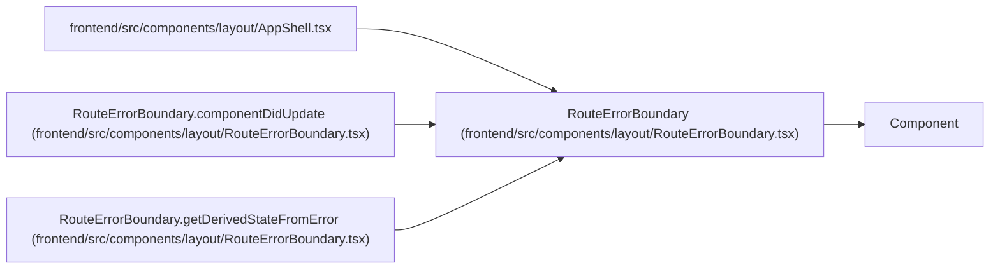

# RouteErrorBoundary

**Location:** `frontend/src/components/layout/RouteErrorBoundary.tsx:18`
**Kind:** Class
**Bases:** `Component`
**Module:** [RouteErrorBoundary](../modules/RouteErrorBoundary.md)

## Description

_Auto-generated from `RouteErrorBoundary` in `frontend/src/components/layout/RouteErrorBoundary.tsx`._

## Attributes

| Name | Type | Default | Description |
|------|------|---------|-------------|
| `state` | `RouteErrorBoundaryState` | `{ error: null }` | — |

## Methods

| Method | Signature | Decorators | Description |
|--------|-----------|------------|-------------|
| `getDerivedStateFromError` | `(error: Error) -> RouteErrorBoundaryState` | — | — |
| `componentDidCatch` | `(error: Error, errorInfo: ErrorInfo)` | — | — |
| `componentDidUpdate` | `(previousProps: RouteErrorBoundaryProps)` | — | — |
| `render` | `()` | — | — |

## Relationships

<!-- Auto-generated relationship summary. Do not edit by hand. -->

### Summary

| Module | Methods | Attributes |
|---|---:|---|
| [RouteErrorBoundary](../modules/RouteErrorBoundary.md) | 4 | `state` |

### Structure

| Kind | Entity | Module |
|---|---|---|
| Base | `Component` | — |

### References

| Reference | Kind | Source | Call sites |
|---|---|---|---:|
| `AppShell` | import | [AppShell](../modules/AppShell.md) | — |
| `RouteErrorBoundary.componentDidUpdate` | type_reference | [RouteErrorBoundary](../modules/RouteErrorBoundary.md) | — |
| `RouteErrorBoundary.getDerivedStateFromError` | type_reference | [RouteErrorBoundary](../modules/RouteErrorBoundary.md) | — |
