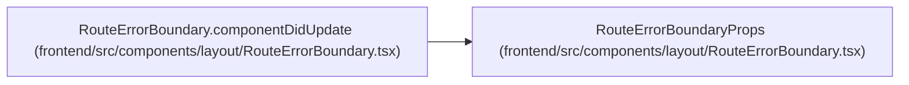

# RouteErrorBoundaryProps

**Location:** `frontend/src/components/layout/RouteErrorBoundary.tsx:5`
**Kind:** Class
**Bases:** —
**Module:** [RouteErrorBoundary](../modules/RouteErrorBoundary.md)

## Description

_Auto-generated from `RouteErrorBoundaryProps` in `frontend/src/components/layout/RouteErrorBoundary.tsx`._

## Attributes

| Name | Type | Required | Default | Description |
|------|------|----------|---------|-------------|
| `children` | `ReactNode` | Yes | — | — |
| `resetKey` | `string` | Yes | — | — |
| `title` | `string` | Yes | — | — |
| `description` | `string` | Yes | — | — |
| `refreshLabel` | `string` | Yes | — | — |
| `homeLabel` | `string` | Yes | — | — |

## Methods

*No public methods. Inherits from base classes.*

## Relationships

<!-- Auto-generated relationship summary. Do not edit by hand. -->

### Summary

| Module | Methods | Attributes |
|---|---:|---|
| [RouteErrorBoundary](../modules/RouteErrorBoundary.md) | 0 | `children`, `description`, `homeLabel`, `refreshLabel`, `resetKey`, `title` |

### References

| Reference | Kind | Source | Call sites |
|---|---|---|---:|
| `RouteErrorBoundary.componentDidUpdate` | type_reference | [RouteErrorBoundary](../modules/RouteErrorBoundary.md) | — |
