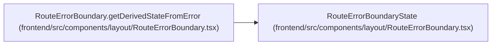

# RouteErrorBoundaryState

**Location:** `frontend/src/components/layout/RouteErrorBoundary.tsx:14`
**Kind:** Class
**Bases:** —
**Module:** [RouteErrorBoundary](../modules/RouteErrorBoundary.md)

## Description

_Auto-generated from `RouteErrorBoundaryState` in `frontend/src/components/layout/RouteErrorBoundary.tsx`._

## Attributes

| Name | Type | Default | Description |
|------|------|---------|-------------|
| `error` | `Error \| null` | *required* | — |

## Methods

*No public methods. Inherits from base classes.*

## Relationships

<!-- Auto-generated relationship summary. Do not edit by hand. -->

### Summary

| Module | Methods | Attributes |
|---|---:|---|
| [RouteErrorBoundary](../modules/RouteErrorBoundary.md) | 0 | `error` |

### References

| Reference | Kind | Source | Call sites |
|---|---|---|---:|
| `RouteErrorBoundary.getDerivedStateFromError` | type_reference | [RouteErrorBoundary](../modules/RouteErrorBoundary.md) | — |
