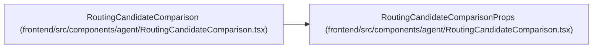

# RoutingCandidateComparisonProps

**Location:** `frontend/src/components/agent/RoutingCandidateComparison.tsx:15`
**Kind:** Class
**Bases:** —
**Module:** [RoutingCandidateComparison](../modules/RoutingCandidateComparison.md)

## Description

_Auto-generated from `RoutingCandidateComparisonProps` in `frontend/src/components/agent/RoutingCandidateComparison.tsx`._

## Attributes

| Name | Type | Default | Description |
|------|------|---------|-------------|
| `preview` | `AgentRoutingPreviewResponse` | *required* | — |
| `roster` | `AgentActorRosterItem[]` | *required* | — |
| `selectedCandidateKey` | `string \| null` | *required* | — |
| `onSelectCandidate` | `(candidate: AgentRoutingCandidate) => void` | *required* | — |
| `selectionDisabled` | `boolean` | *required* | — |

## Methods

*No public methods. Inherits from base classes.*

## Relationships

<!-- Auto-generated relationship summary. Do not edit by hand. -->

### Summary

| Module | Methods | Attributes |
|---|---:|---|
| [RoutingCandidateComparison](../modules/RoutingCandidateComparison.md) | 0 | `onSelectCandidate`, `preview`, `roster`, `selectedCandidateKey`, `selectionDisabled` |

### References

| Reference | Kind | Source | Call sites |
|---|---|---|---:|
| `RoutingCandidateComparison` | type_reference | [RoutingCandidateComparison](../modules/RoutingCandidateComparison.md) | — |
