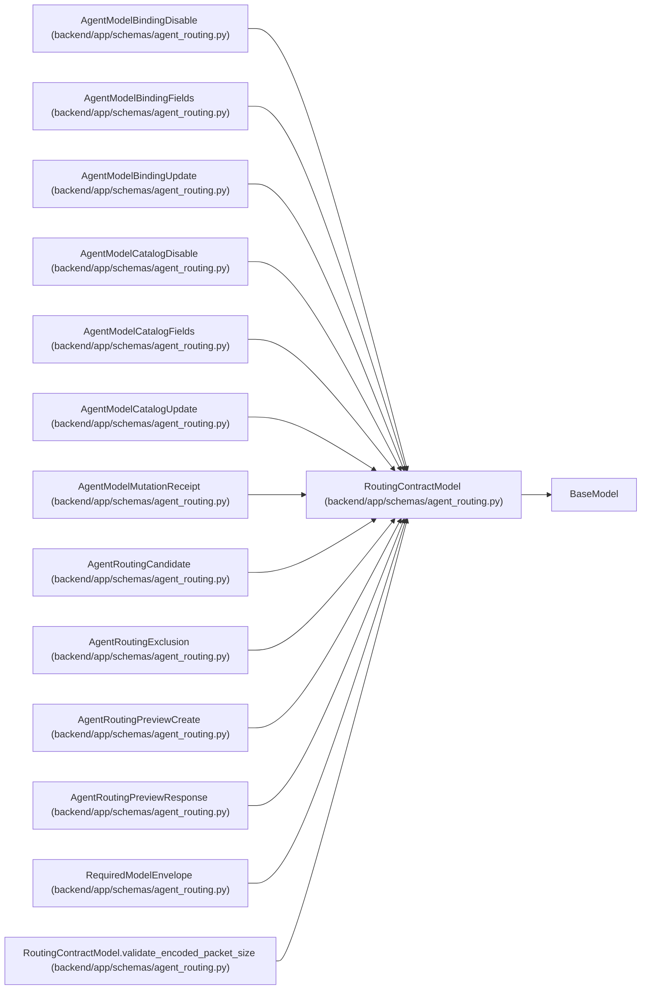

# RoutingContractModel

**Location:** `backend/app/schemas/agent_routing.py:204`
**Kind:** Pydantic model
**Bases:** `BaseModel`
**Module:** [agent_routing](../modules/agent_routing.md)

## Description

Strict deterministic base for data crossing a routing boundary.

## Model Configuration

| Setting | Value | Source |
|---------|-------|--------|
| `extra` | `'forbid'` | model_config |
| `from_attributes` | `True` | model_config |
| `allow_inf_nan` | `False` | model_config |
| `use_enum_values` | `True` | model_config |

## Validators

| Method | Scope | Fields | Mode | Options |
|--------|-------|--------|------|---------|
| `validate_encoded_packet_size` | model | — | after | — |

## Attributes

*No annotated attributes found.*

## Methods

| Method | Signature | Decorators | Description |
|--------|-----------|------------|-------------|
| `validate_encoded_packet_size` | `() -> 'RoutingContractModel'` | `@model_validator(mode='after')` | — |
| `canonical_json_bytes` | `() -> bytes` | — | Return byte-stable normalized JSON for digests and parity checks. |

## Relationships

<!-- Auto-generated relationship summary. Do not edit by hand. -->

### Summary

| Module | Methods | Attributes |
|---|---:|---|
| [agent_routing](../modules/agent_routing.md) | 2 | — |

### Structure

| Kind | Entity | Module |
|---|---|---|
| Base | `BaseModel` | — |
| Subclass | `AgentModelBindingDisable` | [agent_routing](../modules/agent_routing.md) |
| Subclass | `AgentModelBindingFields` | [agent_routing](../modules/agent_routing.md) |
| Subclass | `AgentModelBindingUpdate` | [agent_routing](../modules/agent_routing.md) |
| Subclass | `AgentModelCatalogDisable` | [agent_routing](../modules/agent_routing.md) |
| Subclass | `AgentModelCatalogFields` | [agent_routing](../modules/agent_routing.md) |
| Subclass | `AgentModelCatalogUpdate` | [agent_routing](../modules/agent_routing.md) |
| Subclass | `AgentModelMutationReceipt` | [agent_routing](../modules/agent_routing.md) |
| Subclass | `AgentRoutingCandidate` | [agent_routing](../modules/agent_routing.md) |
| Subclass | `AgentRoutingExclusion` | [agent_routing](../modules/agent_routing.md) |
| Subclass | `AgentRoutingPreviewCreate` | [agent_routing](../modules/agent_routing.md) |
| Subclass | `AgentRoutingPreviewResponse` | [agent_routing](../modules/agent_routing.md) |
| Subclass | `RequiredModelEnvelope` | [agent_routing](../modules/agent_routing.md) |

### References

| Reference | Kind | Source | Call sites |
|---|---|---|---:|
| `RoutingContractModel.validate_encoded_packet_size` | type_reference | [agent_routing](../modules/agent_routing.md) | — |
