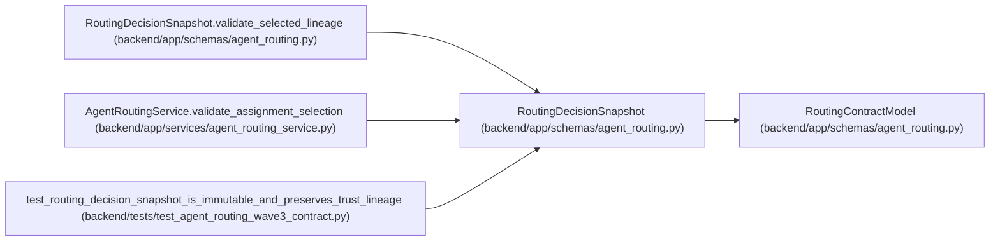

# RoutingDecisionSnapshot

**Location:** `backend/app/schemas/agent_routing.py:1316`
**Kind:** Pydantic model
**Bases:** `RoutingContractModel`
**Module:** [agent_routing](../modules/agent_routing.md)

## Description

Immutable server-generated evidence for one exact routing selection.

## Model Configuration

| Setting | Value | Source |
|---------|-------|--------|
| `extra` | `'forbid'` | model_config |
| `from_attributes` | `True` | model_config |
| `allow_inf_nan` | `False` | model_config |
| `use_enum_values` | `True` | model_config |
| `frozen` | `True` | model_config |

## Validators

| Method | Scope | Fields | Mode | Options |
|--------|-------|--------|------|---------|
| `strip_snapshot_text` | field | profile_revision, configured_model_alias, resolved_model, routing_preview_id, rationale | after | — |
| `validate_snapshot_assessment_reasons` | field | assessment_reason_codes | before | — |
| `validate_selection_reasons` | field | selection_reason_codes | before | — |
| `validate_prior_lineage_packet` | field | prior_lineage | before | — |
| `validate_selected_lineage` | model | — | after | — |

## Attributes

| Name | Type | Wire name | Required | Nullable | Default | Constraints | Examples | Description |
|------|------|-----------|----------|----------|---------|-------------|-------------|----------|
| `schema_version` | `Literal['routing-decision-snapshot-v1']` | `schema_version` | No | No | `'routing-decision-snapshot-v1'` | — | — | — |
| `authority` | `Literal['agent-routing-service-v1']` | `authority` | No | No | `'agent-routing-service-v1'` | — | — | — |
| `selection_pending` | `Literal[False]` | `selection_pending` | No | No | `False` | — | — | — |
| `policy_version` | `Literal['model-aware-routing-v1']` | `policy_version` | No | No | `ROUTING_POLICY_VERSION` | — | — | — |
| `task_id` | `int` | `task_id` | Yes | No | — | ge=1; strict=True | — | — |
| `topology_key` | `str \| None` | `topology_key` | No | Yes | `None` | max_length=100; min_length=1 | — | — |
| `topology_revision` | `int \| None` | `topology_revision` | No | Yes | `None` | ge=1; strict=True | — | — |
| `task_version` | `int` | `task_version` | Yes | No | — | ge=1; strict=True | — | — |
| `assessment_id` | `int` | `assessment_id` | Yes | No | — | ge=1; strict=True | — | — |
| `assessment_task_version` | `int` | `assessment_task_version` | Yes | No | — | ge=1; strict=True | — | — |
| `assessment_band` | `TaskDifficultyBand` | `assessment_band` | Yes | No | — | — | — | — |
| `assessment_confidence` | `float` | `assessment_confidence` | Yes | No | — | le=1.0; ge=unknown (MIN_ROUTING_ASSESSMENT_CONFIDENCE) | — | — |
| `assessment_reason_codes` | `tuple[AssessmentReasonCode, ...]` | `assessment_reason_codes` | No | No | `()` | — | — | — |
| `purpose` | `Literal['execution', 'verification']` | `purpose` | Yes | No | — | — | — | — |
| `actor_id` | `int` | `actor_id` | Yes | No | — | ge=1; strict=True | — | — |
| `actor_revision` | `PositiveRevision` | `actor_revision` | Yes | No | — | — | — | — |
| `actor_queue_revision` | `PositiveRevision` | `actor_queue_revision` | Yes | No | — | — | — | — |
| `profile_id` | `int` | `profile_id` | Yes | No | — | ge=1; strict=True | — | — |
| `profile_revision` | `str` | `profile_revision` | Yes | No | — | max_length=120; min_length=1 | — | — |
| `capacity_owner_id` | `int \| None` | `capacity_owner_id` | No | Yes | `None` | ge=1; strict=True | — | — |
| `capacity_owner_profile_id` | `int \| None` | `capacity_owner_profile_id` | No | Yes | `None` | ge=1; strict=True | — | — |
| `model_binding_id` | `int` | `model_binding_id` | Yes | No | — | ge=1; strict=True | — | — |
| `model_binding_revision` | `PositiveRevision` | `model_binding_revision` | Yes | No | — | — | — | — |
| `model_catalog_id` | `int` | `model_catalog_id` | Yes | No | — | ge=1; strict=True | — | — |
| `model_catalog_key` | `RoutingKey` | `model_catalog_key` | Yes | No | — | — | — | — |
| `model_catalog_revision` | `PositiveRevision` | `model_catalog_revision` | Yes | No | — | — | — | — |
| `configured_model_alias` | `str` | `configured_model_alias` | Yes | No | — | max_length=255; min_length=1 | — | — |
| `selected_reasoning_tier` | `ReasoningTier` | `selected_reasoning_tier` | Yes | No | — | — | — | — |
| `selected_context_tier` | `ModelContextTier` | `selected_context_tier` | Yes | No | — | — | — | — |
| `resolved_model` | `str \| None` | `resolved_model` | No | Yes | `None` | max_length=255; min_length=1 | — | — |
| `review_mode` | `TaskReviewMode` | `review_mode` | Yes | No | — | — | — | — |
| `reviewer_profile_id` | `int \| None` | `reviewer_profile_id` | No | Yes | `None` | ge=1; strict=True | — | — |
| `routing_preview_id` | `str` | `routing_preview_id` | Yes | No | — | max_length=255; min_length=1 | — | — |
| `routing_preview_digest` | `RoutingDigest` | `routing_preview_digest` | Yes | No | — | — | — | — |
| `input_digest` | `RoutingDigest` | `input_digest` | Yes | No | — | — | — | — |
| `preview_generated_at` | `datetime` | `preview_generated_at` | Yes | No | — | — | — | — |
| `preview_expires_at` | `datetime` | `preview_expires_at` | Yes | No | — | — | — | — |
| `selected_rank` | `int` | `selected_rank` | Yes | No | — | ge=1; strict=True | — | — |
| `adequacy_class` | `int` | `adequacy_class` | Yes | No | — | ge=0; strict=True | — | — |
| `selection_reason_codes` | `tuple[RoutingKey, ...]` | `selection_reason_codes` | No | No | `()` | — | — | — |
| `eligible_candidate_summaries` | `tuple[RoutingCandidateSummary, ...]` | `eligible_candidate_summaries` | Yes | No | — | min_length=1; max_length=unknown (MAX_ROUTING_CANDIDATES) | — | — |
| `exclusion_summaries` | `tuple[RoutingExclusionSummary, ...]` | `exclusion_summaries` | No | No | `()` | max_length=unknown (MAX_ROUTING_EXCLUSIONS) | — | — |
| `eligible_candidates_omitted` | `int` | `eligible_candidates_omitted` | No | No | `0` | ge=0; strict=True | — | — |
| `exclusions_omitted` | `int` | `exclusions_omitted` | No | No | `0` | ge=0; strict=True | — | — |
| `rationale` | `str` | `rationale` | Yes | No | — | max_length=2000; min_length=1 | — | — |
| `confidence` | `float` | `confidence` | Yes | No | — | le=1.0; ge=unknown (MIN_ROUTING_ASSESSMENT_CONFIDENCE) | — | — |
| `trust_lineage` | `RoutingTrustLineage` | `trust_lineage` | Yes | No | — | — | — | — |
| `prior_lineage` | `dict[str, Any] \| None` | `prior_lineage` | No | Yes | `None` | — | — | — |

## Methods

| Method | Signature | Decorators | Description |
|--------|-----------|------------|-------------|
| `strip_snapshot_text` | `(value: str \| None) -> str \| None` | `@field_validator('profile_revision', 'configured_model_alias', 'resolved_model', 'routing_preview_id', 'rationale')`, `@classmethod` | — |
| `validate_snapshot_assessment_reasons` | `(value: Any) -> Any` | `@field_validator('assessment_reason_codes', mode='before')`, `@classmethod` | — |
| `validate_selection_reasons` | `(value: Any) -> Any` | `@field_validator('selection_reason_codes', mode='before')`, `@classmethod` | — |
| `validate_prior_lineage_packet` | `(value: Any) -> dict[str, Any] \| None` | `@field_validator('prior_lineage', mode='before')`, `@classmethod` | — |
| `validate_selected_lineage` | `() -> 'RoutingDecisionSnapshot'` | `@model_validator(mode='after')` | — |

## Relationships

<!-- Auto-generated relationship summary. Do not edit by hand. -->

### Summary

| Module | Methods | Attributes |
|---|---:|---|
| [agent_routing](../modules/agent_routing.md) | 5 | `actor_id`, `actor_queue_revision`, `actor_revision`, `adequacy_class`, `assessment_band`, `assessment_confidence`, `assessment_id`, `assessment_reason_codes`, `assessment_task_version`, `authority`, `capacity_owner_id`, `capacity_owner_profile_id` |

### Structure

| Kind | Entity | Module |
|---|---|---|
| Base | `RoutingContractModel` | [agent_routing](../modules/agent_routing.md) |

### References

| Reference | Kind | Source | Call sites |
|---|---|---|---:|
| `RoutingDecisionSnapshot.validate_selected_lineage` | type_reference | [agent_routing](../modules/agent_routing.md) | — |
| `AgentRoutingService.validate_assignment_selection` | call | [agent_routing_service](../modules/agent_routing_service.md) | 1 |
| `test_routing_decision_snapshot_is_immutable_and_preserves_trust_lineage` | call | [test_agent_routing_wave3_contract](../modules/test_agent_routing_wave3_contract.md) | 1 |
