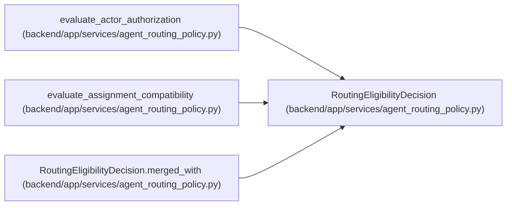

# RoutingEligibilityDecision

**Location:** `backend/app/services/agent_routing_policy.py:543`
**Kind:** Class
**Bases:** —
**Module:** [agent_routing_policy](../modules/agent_routing_policy.md)

**Decorators:** `@dataclass(frozen=True)`

## Description

Separated authority/compatibility evidence for one candidate.

## Attributes

| Name | Type | Default | Description |
|------|------|---------|-------------|
| `authority_evaluated` | `bool` | `False` | — |
| `compatibility_evaluated` | `bool` | `False` | — |
| `authority_blocker_codes` | `tuple[str, ...]` | `()` | — |
| `compatibility_blocker_codes` | `tuple[str, ...]` | `()` | — |
| `missing_specialist_skills` | `tuple[str, ...]` | `()` | — |

## Methods

| Method | Signature | Decorators | Description |
|--------|-----------|------------|-------------|
| `hard_blocker_codes` | `() -> tuple[str, ...]` | `@property` | Return the deterministic de-duplicated union of both blocker sets. |
| `authorized` | `() -> bool` | `@property` | — |
| `compatible` | `() -> bool` | `@property` | — |
| `eligible` | `() -> bool` | `@property` | — |
| `merged_with` | `(other: 'RoutingEligibilityDecision') -> 'RoutingEligibilityDecision'` | — | Combine separately evaluated authority and compatibility evidence. |

## Relationships

<!-- Auto-generated relationship summary. Do not edit by hand. -->

### Summary

| Module | Methods | Attributes |
|---|---:|---|
| [agent_routing_policy](../modules/agent_routing_policy.md) | 5 | `authority_blocker_codes`, `authority_evaluated`, `compatibility_blocker_codes`, `compatibility_evaluated`, `missing_specialist_skills` |

### References

| Reference | Kind | Source | Call sites |
|---|---|---|---:|
| `evaluate_actor_authorization` | call | [agent_routing_policy](../modules/agent_routing_policy.md) | 1 |
| `evaluate_actor_authorization` | type_reference | [agent_routing_policy](../modules/agent_routing_policy.md) | — |
| `evaluate_assignment_compatibility` | call | [agent_routing_policy](../modules/agent_routing_policy.md) | 2 |
| `evaluate_assignment_compatibility` | type_reference | [agent_routing_policy](../modules/agent_routing_policy.md) | — |
| `RoutingEligibilityDecision.merged_with` | call | [agent_routing_policy](../modules/agent_routing_policy.md) | 1 |
| `RoutingEligibilityDecision.merged_with` | type_reference | [agent_routing_policy](../modules/agent_routing_policy.md) | — |
