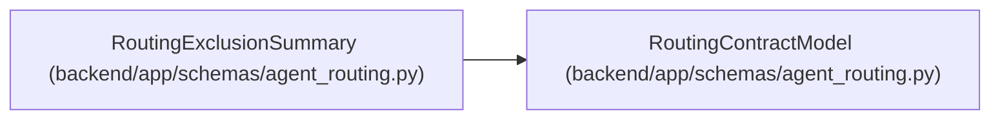

# RoutingExclusionSummary

**Location:** `backend/app/schemas/agent_routing.py:1250`
**Kind:** Pydantic model
**Bases:** `RoutingContractModel`
**Module:** [agent_routing](../modules/agent_routing.md)

## Description

Compact actionable exclusion evidence retained on assignment.

## Validators

| Method | Scope | Fields | Mode | Options |
|--------|-------|--------|------|---------|
| `validate_blocker_codes` | field | hard_blocker_codes | before | — |

## Attributes

| Name | Type | Wire name | Required | Nullable | Default | Constraints | Examples | Description |
|------|------|-----------|----------|----------|---------|-------------|-------------|----------|
| `actor_id` | `int` | `actor_id` | Yes | No | — | strict=True; ge=1 | — | — |
| `model_binding_id` | `int \| None` | `model_binding_id` | No | Yes | `None` | strict=True; ge=1 | — | — |
| `hard_blocker_codes` | `tuple[RoutingBlockerCode, ...]` | `hard_blocker_codes` | Yes | No | — | min_length=1; max_length=unknown (len(RoutingBlockerCode)) | — | — |

## Methods

| Method | Signature | Decorators | Description |
|--------|-----------|------------|-------------|
| `validate_blocker_codes` | `(value: Any) -> Any` | `@field_validator('hard_blocker_codes', mode='before')`, `@classmethod` | — |

## Relationships

<!-- Auto-generated relationship summary. Do not edit by hand. -->

### Summary

| Module | Methods | Attributes |
|---|---:|---|
| [agent_routing](../modules/agent_routing.md) | 1 | `actor_id`, `hard_blocker_codes`, `model_binding_id` |

### Structure

| Kind | Entity | Module |
|---|---|---|
| Base | `RoutingContractModel` | [agent_routing](../modules/agent_routing.md) |
