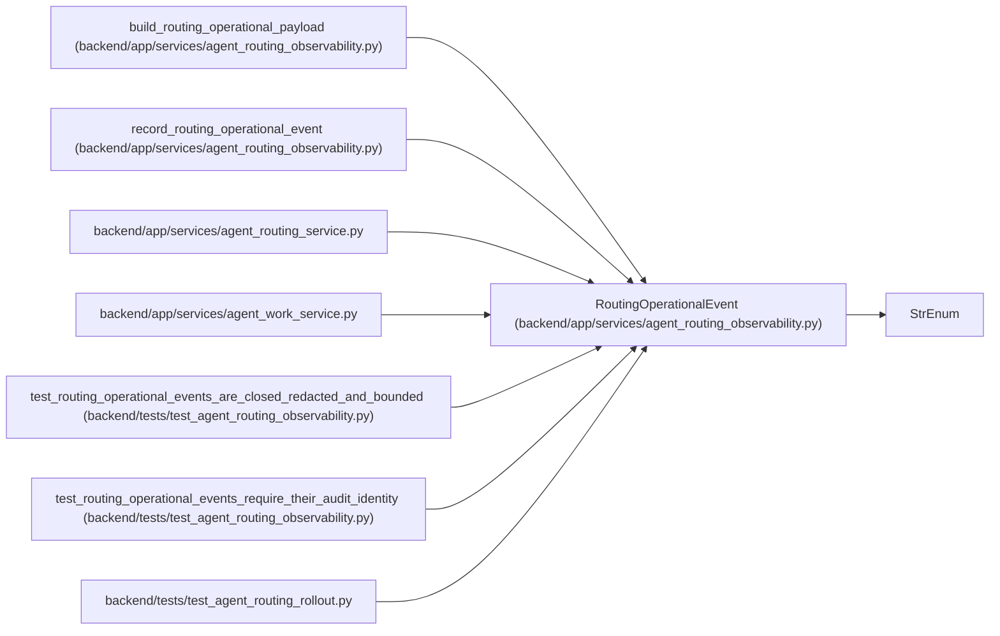

# RoutingOperationalEvent

**Location:** `backend/app/services/agent_routing_observability.py:37`
**Kind:** Enum
**Bases:** `StrEnum`
**Module:** [agent_routing_observability](../modules/agent_routing_observability.md)

## Description

Closed, low-cardinality routing outcome vocabulary.

## Attributes

| Name | Declared value | Description |
|------|-------|-------------|
| `ASSESSMENT_CREATED` | `'assessment_created'` | — |
| `PREVIEW_RECORDED` | `'preview_recorded'` | — |
| `NO_ELIGIBLE_CANDIDATE` | `'no_eligible_candidate'` | — |
| `ASSIGNMENT_SELECTED` | `'assignment_selected'` | — |
| `STALE_CONFLICT` | `'stale_conflict'` | — |
| `CONFIGURED_OBSERVED_MISMATCH` | `'configured_observed_mismatch'` | — |
| `VERIFIER_REJECTED` | `'verifier_rejected'` | — |
| `REWORK_CREATED` | `'rework_created'` | — |
| `TIER_ESCALATED` | `'tier_escalated'` | — |

## Methods

*No public methods. Inherits from base classes.*

## Relationships

<!-- Auto-generated relationship summary. Do not edit by hand. -->

### Summary

| Module | Methods | Attributes |
|---|---:|---|
| [agent_routing_observability](../modules/agent_routing_observability.md) | 0 | `ASSESSMENT_CREATED`, `ASSIGNMENT_SELECTED`, `CONFIGURED_OBSERVED_MISMATCH`, `NO_ELIGIBLE_CANDIDATE`, `PREVIEW_RECORDED`, `REWORK_CREATED`, `STALE_CONFLICT`, `TIER_ESCALATED`, `VERIFIER_REJECTED` |

### Structure

| Kind | Entity | Module |
|---|---|---|
| Base | `StrEnum` | — |

### References

| Reference | Kind | Source | Call sites |
|---|---|---|---:|
| `build_routing_operational_payload` | call | [agent_routing_observability](../modules/agent_routing_observability.md) | 1 |
| `build_routing_operational_payload` | type_reference | [agent_routing_observability](../modules/agent_routing_observability.md) | — |
| `record_routing_operational_event` | call | [agent_routing_observability](../modules/agent_routing_observability.md) | 1 |
| `record_routing_operational_event` | type_reference | [agent_routing_observability](../modules/agent_routing_observability.md) | — |
| `agent_routing_service` | import | [agent_routing_service](../modules/agent_routing_service.md) | — |
| `agent_work_service` | import | [agent_work_service](../modules/agent_work_service.md) | — |
| `test_routing_operational_events_are_closed_redacted_and_bounded` | type_reference | [test_agent_routing_observability](../modules/test_agent_routing_observability.md) | — |
| `test_routing_operational_events_require_their_audit_identity` | type_reference | [test_agent_routing_observability](../modules/test_agent_routing_observability.md) | — |
| `test_agent_routing_rollout` | import | [test_agent_routing_rollout](../modules/test_agent_routing_rollout.md) | — |
