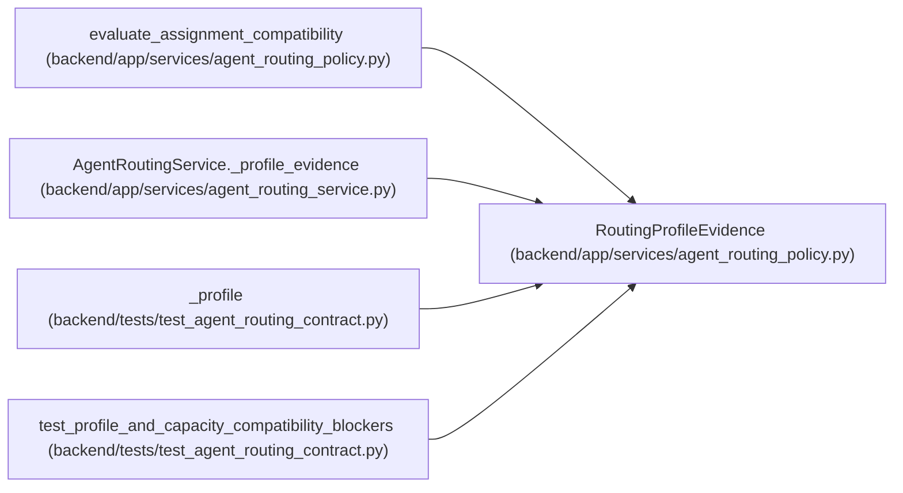

# RoutingProfileEvidence

**Location:** `backend/app/services/agent_routing_policy.py:528`
**Kind:** Class
**Bases:** —
**Module:** [agent_routing_policy](../modules/agent_routing_policy.md)

**Decorators:** `@dataclass(frozen=True)`

## Description

Secret-free profile evidence used by compatibility decisions.

## Attributes

| Name | Type | Default | Description |
|------|------|---------|-------------|
| `profile_id` | `int` | *required* | — |
| `profile_kind` | `str` | *required* | — |
| `automation_enabled` | `bool` | *required* | — |
| `assignment_modes` | `frozenset[str]` | `field(default_factory=frozenset)` | — |
| `skill_levels` | `Mapping[str, int]` | `field(default_factory=dict)` | — |
| `weakness_keys` | `frozenset[str]` | `field(default_factory=frozenset)` | — |

## Methods

*No public methods. Inherits from base classes.*

## Relationships

<!-- Auto-generated relationship summary. Do not edit by hand. -->

### Summary

| Module | Methods | Attributes |
|---|---:|---|
| [agent_routing_policy](../modules/agent_routing_policy.md) | 0 | `assignment_modes`, `automation_enabled`, `profile_id`, `profile_kind`, `skill_levels`, `weakness_keys` |

### References

| Reference | Kind | Source | Call sites |
|---|---|---|---:|
| `evaluate_assignment_compatibility` | type_reference | [agent_routing_policy](../modules/agent_routing_policy.md) | — |
| `AgentRoutingService._profile_evidence` | call | [agent_routing_service](../modules/agent_routing_service.md) | 1 |
| `AgentRoutingService._profile_evidence` | type_reference | [agent_routing_service](../modules/agent_routing_service.md) | — |
| `_profile` | call | [test_agent_routing_contract](../modules/test_agent_routing_contract.md) | 1 |
| `_profile` | type_reference | [test_agent_routing_contract](../modules/test_agent_routing_contract.md) | — |
| `test_profile_and_capacity_compatibility_blockers` | type_reference | [test_agent_routing_contract](../modules/test_agent_routing_contract.md) | — |
