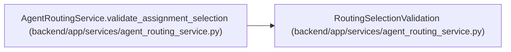

# RoutingSelectionValidation

**Location:** `backend/app/services/agent_routing_service.py:132`
**Kind:** Class
**Bases:** —
**Module:** [agent_routing_service](../modules/agent_routing_service.md)

**Decorators:** `@dataclass(frozen=True)`

## Description

Authoritative result consumed inside the assignment transaction.

## Attributes

| Name | Type | Default | Description |
|------|------|---------|-------------|
| `assessment` | `TaskRoutingAssessment` | *required* | — |
| `binding` | `AgentModelBinding` | *required* | — |
| `preview` | `AgentRoutingPreviewResponse` | *required* | — |
| `snapshot` | `RoutingDecisionSnapshot` | *required* | — |

## Methods

*No public methods. Inherits from base classes.*

## Relationships

<!-- Auto-generated relationship summary. Do not edit by hand. -->

### Summary

| Module | Methods | Attributes |
|---|---:|---|
| [agent_routing_service](../modules/agent_routing_service.md) | 0 | `assessment`, `binding`, `preview`, `snapshot` |

### References

| Reference | Kind | Source | Call sites |
|---|---|---|---:|
| `AgentRoutingService.validate_assignment_selection` | call | [agent_routing_service](../modules/agent_routing_service.md) | 1 |
| `AgentRoutingService.validate_assignment_selection` | type_reference | [agent_routing_service](../modules/agent_routing_service.md) | — |
