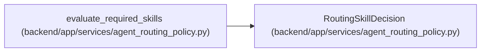

# RoutingSkillDecision

**Location:** `backend/app/services/agent_routing_policy.py:613`
**Kind:** Class
**Bases:** —
**Module:** [agent_routing_policy](../modules/agent_routing_policy.md)

**Decorators:** `@dataclass(frozen=True)`

## Description

Deterministic required-skill evidence for one profile.

## Attributes

| Name | Type | Default | Description |
|------|------|---------|-------------|
| `hard_blocker_codes` | `tuple[str, ...]` | `()` | — |
| `matched_skill_levels` | `tuple[tuple[str, int], ...]` | `()` | — |
| `missing_skill_keys` | `tuple[str, ...]` | `()` | — |
| `insufficient_skill_keys` | `tuple[str, ...]` | `()` | — |
| `blocking_weakness_keys` | `tuple[str, ...]` | `()` | — |

## Methods

| Method | Signature | Decorators | Description |
|--------|-----------|------------|-------------|
| `eligible` | `() -> bool` | `@property` | — |

## Relationships

<!-- Auto-generated relationship summary. Do not edit by hand. -->

### Summary

| Module | Methods | Attributes |
|---|---:|---|
| [agent_routing_policy](../modules/agent_routing_policy.md) | 1 | `blocking_weakness_keys`, `hard_blocker_codes`, `insufficient_skill_keys`, `matched_skill_levels`, `missing_skill_keys` |

### References

| Reference | Kind | Source | Call sites |
|---|---|---|---:|
| `evaluate_required_skills` | call | [agent_routing_policy](../modules/agent_routing_policy.md) | 1 |
| `evaluate_required_skills` | type_reference | [agent_routing_policy](../modules/agent_routing_policy.md) | — |
