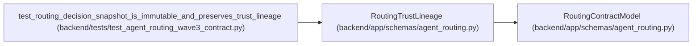

# RoutingTrustLineage

**Location:** `backend/app/schemas/agent_routing.py:1281`
**Kind:** Pydantic model
**Bases:** `RoutingContractModel`
**Module:** [agent_routing](../modules/agent_routing.md)

## Description

Secret-free identities responsible for each routing evidence boundary.

## Model Configuration

| Setting | Value | Source |
|---------|-------|--------|
| `extra` | `'forbid'` | model_config |
| `from_attributes` | `True` | model_config |
| `allow_inf_nan` | `False` | model_config |
| `use_enum_values` | `True` | model_config |
| `frozen` | `True` | model_config |

## Validators

| Method | Scope | Fields | Mode | Options |
|--------|-------|--------|------|---------|
| `strip_assessor` | field | assessment_assessor | after | — |

## Attributes

| Name | Type | Wire name | Required | Nullable | Default | Constraints | Examples | Description |
|------|------|-----------|----------|----------|---------|-------------|-------------|----------|
| `assessment_assessor` | `str` | `assessment_assessor` | Yes | No | — | min_length=1; max_length=255 | — | — |
| `assessment_assessor_actor_id` | `int \| None` | `assessment_assessor_actor_id` | No | Yes | `None` | strict=True; ge=1 | — | — |
| `preview_requested_by_actor_id` | `int` | `preview_requested_by_actor_id` | Yes | No | — | strict=True; ge=1 | — | — |
| `assignment_created_by_actor_id` | `int` | `assignment_created_by_actor_id` | Yes | No | — | strict=True; ge=1 | — | — |
| `execution_actor_id` | `int` | `execution_actor_id` | Yes | No | — | strict=True; ge=1 | — | — |
| `observed_model_reported_by_actor_id` | `int \| None` | `observed_model_reported_by_actor_id` | No | Yes | `None` | strict=True; ge=1 | — | — |

## Methods

| Method | Signature | Decorators | Description |
|--------|-----------|------------|-------------|
| `strip_assessor` | `(value: str) -> str` | `@field_validator('assessment_assessor')`, `@classmethod` | — |

## Relationships

<!-- Auto-generated relationship summary. Do not edit by hand. -->

### Summary

| Module | Methods | Attributes |
|---|---:|---|
| [agent_routing](../modules/agent_routing.md) | 1 | `assessment_assessor`, `assessment_assessor_actor_id`, `assignment_created_by_actor_id`, `execution_actor_id`, `observed_model_reported_by_actor_id`, `preview_requested_by_actor_id` |

### Structure

| Kind | Entity | Module |
|---|---|---|
| Base | `RoutingContractModel` | [agent_routing](../modules/agent_routing.md) |

### References

| Reference | Kind | Source | Call sites |
|---|---|---|---:|
| `test_routing_decision_snapshot_is_immutable_and_preserves_trust_lineage` | call | [test_agent_routing_wave3_contract](../modules/test_agent_routing_wave3_contract.md) | 1 |
