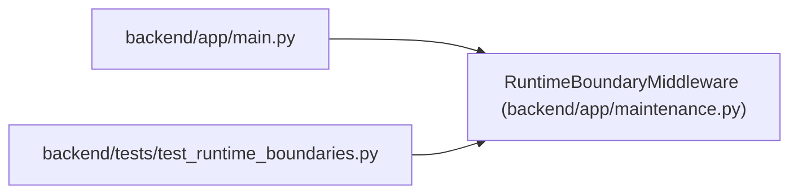

# RuntimeBoundaryMiddleware

**Location:** `backend/app/maintenance.py:134`
**Kind:** Class
**Bases:** —
**Module:** [maintenance](../modules/maintenance.md)

## Description

Enforce REST fencing and record bounded request/drain telemetry.

## Attributes

*No annotated attributes found.*

## Methods

| Method | Signature | Decorators | Description |
|--------|-----------|------------|-------------|
| `__init__` | `(app: ASGIApp)` | — | — |
| `__call__` | *(async)* `(scope: Scope, receive: Receive, send: Send) -> None` | — | — |

## Relationships

<!-- Auto-generated relationship summary. Do not edit by hand. -->

### Summary

| Module | Methods | Attributes |
|---|---:|---|
| [maintenance](../modules/maintenance.md) | 2 | — |

### References

| Reference | Kind | Source | Call sites |
|---|---|---|---:|
| `main` | import | [app_main](../modules/app_main.md) | — |
| `test_runtime_boundaries` | import | [test_runtime_boundaries](../modules/test_runtime_boundaries.md) | — |
