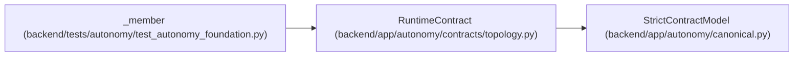

# RuntimeContract

**Location:** `backend/app/autonomy/contracts/topology.py:124`
**Kind:** Pydantic model
**Bases:** `StrictContractModel`
**Module:** [topology](../modules/topology.md)

## Description

_Auto-generated from `RuntimeContract` in `backend/app/autonomy/contracts/topology.py`._

## Attributes

| Name | Type | Wire name | Required | Nullable | Default | Constraints | Examples | Description |
|------|------|-----------|----------|----------|---------|-------------|-------------|----------|
| `runtime_ref` | `str` | `runtime_ref` | Yes | No | — | max_length=1024; pattern=unknown (OPAQUE_REF_PATTERN) | — | — |
| `image_digest` | `str` | `image_digest` | Yes | No | — | pattern='^sha256:[0-9a-f]{64}$' | — | — |
| `sandbox_profile` | `str` | `sandbox_profile` | Yes | No | — | pattern=unknown (LOGICAL_KEY_PATTERN) | — | — |
| `attestation_policy_digest` | `str` | `attestation_policy_digest` | Yes | No | — | pattern=unknown (SHA256_PATTERN) | — | — |

## Methods

*No public methods. Inherits from base classes.*

## Relationships

<!-- Auto-generated relationship summary. Do not edit by hand. -->

### Summary

| Module | Methods | Attributes |
|---|---:|---|
| [topology](../modules/topology.md) | 0 | `attestation_policy_digest`, `image_digest`, `runtime_ref`, `sandbox_profile` |

### Structure

| Kind | Entity | Module |
|---|---|---|
| Base | `StrictContractModel` | [autonomy_canonical](../modules/autonomy_canonical.md) |

### References

| Reference | Kind | Source | Call sites |
|---|---|---|---:|
| `_member` | call | [test_autonomy_foundation](../modules/test_autonomy_foundation.md) | 1 |
