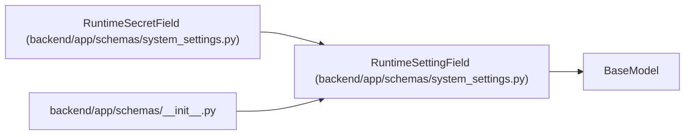

# RuntimeSettingField

**Location:** `backend/app/schemas/system_settings.py:13`
**Kind:** Pydantic model
**Bases:** `BaseModel`
**Module:** [schemas_system_settings](../modules/schemas_system_settings.md)

## Description

One resolved runtime setting field.

## Attributes

| Name | Type | Wire name | Required | Nullable | Default | Constraints | Examples | Description |
|------|------|-----------|----------|----------|---------|-------------|-------------|----------|
| `source` | `RuntimeSettingSource` | `source` | Yes | No | — | — | — | — |

## Methods

*No public methods. Inherits from base classes.*

## Relationships

<!-- Auto-generated relationship summary. Do not edit by hand. -->

### Summary

| Module | Methods | Attributes |
|---|---:|---|
| [schemas_system_settings](../modules/schemas_system_settings.md) | 0 | `source` |

### Structure

| Kind | Entity | Module |
|---|---|---|
| Base | `BaseModel` | — |
| Subclass | `RuntimeSecretField` | [schemas_system_settings](../modules/schemas_system_settings.md) |

### References

| Reference | Kind | Source | Call sites |
|---|---|---|---:|
| `__init__` | import | [schemas___init__](../modules/schemas___init__.md) | — |
