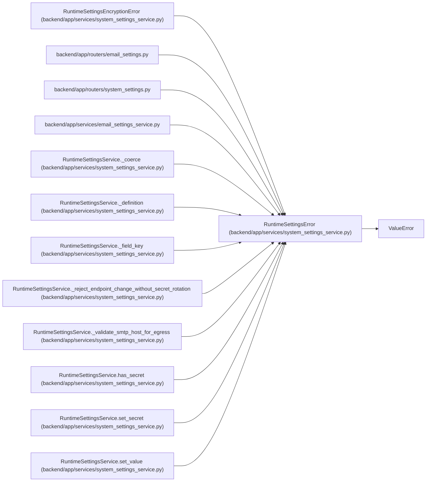

# RuntimeSettingsError

**Location:** `backend/app/services/system_settings_service.py:38`
**Kind:** Class
**Bases:** `ValueError`
**Module:** [system_settings_service](../modules/system_settings_service.md)

## Description

Raised when a runtime settings update is invalid.

## Attributes

*No annotated attributes found.*

## Methods

*No public methods. Inherits from base classes.*

## Relationships

<!-- Auto-generated relationship summary. Do not edit by hand. -->

### Summary

| Module | Methods | Attributes |
|---|---:|---|
| [system_settings_service](../modules/system_settings_service.md) | 0 | — |

### Structure

| Kind | Entity | Module |
|---|---|---|
| Base | `ValueError` | — |
| Subclass | `RuntimeSettingsEncryptionError` | [system_settings_service](../modules/system_settings_service.md) |

### References

| Reference | Kind | Source | Call sites |
|---|---|---|---:|
| `email_settings` | import | [routers_email_settings](../modules/routers_email_settings.md) | — |
| `system_settings` | import | [routers_system_settings](../modules/routers_system_settings.md) | — |
| `email_settings_service` | import | [email_settings_service](../modules/email_settings_service.md) | — |
| `RuntimeSettingsService._coerce` | call | [system_settings_service](../modules/system_settings_service.md) | 14 |
| `RuntimeSettingsService._definition` | call | [system_settings_service](../modules/system_settings_service.md) | 1 |
| `RuntimeSettingsService._field_key` | call | [system_settings_service](../modules/system_settings_service.md) | 1 |
| `RuntimeSettingsService._reject_endpoint_change_without_secret_rotation` | call | [system_settings_service](../modules/system_settings_service.md) | 1 |
| `RuntimeSettingsService._validate_smtp_host_for_egress` | call | [system_settings_service](../modules/system_settings_service.md) | 1 |
| `RuntimeSettingsService.has_secret` | call | [system_settings_service](../modules/system_settings_service.md) | 1 |
| `RuntimeSettingsService.set_secret` | call | [system_settings_service](../modules/system_settings_service.md) | 2 |
| `RuntimeSettingsService.set_value` | call | [system_settings_service](../modules/system_settings_service.md) | 1 |
