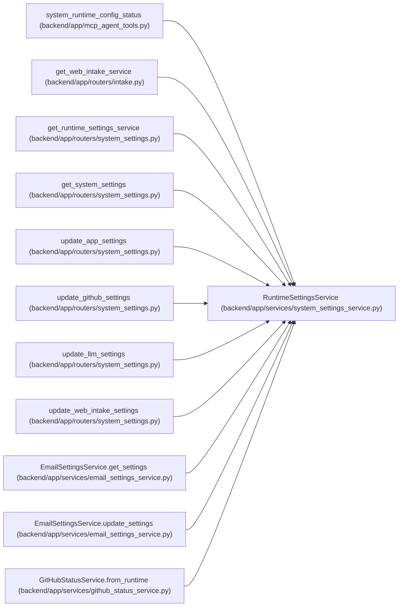

# RuntimeSettingsService

**Location:** `backend/app/services/system_settings_service.py:116`
**Kind:** Class
**Bases:** —
**Module:** [system_settings_service](../modules/system_settings_service.md)

## Description

Read, update, and resolve catalogued runtime system settings.

## Attributes

*No annotated attributes found.*

## Methods

| Method | Signature | Decorators | Description |
|--------|-----------|------------|-------------|
| `__init__` | `(db: AsyncSession, settings_override = None)` | — | — |
| `_fernet` | `() -> Fernet` | — | — |
| `_encrypt_secret` | `(value: str) -> str` | — | — |
| `_decrypt_secret` | `(value: str) -> str` | — | — |
| `_row` | *(async)* `(key: str) -> Optional[SystemSetting]` | — | — |
| `_category_rows` | *(async)* `(category: str) -> list[SystemSetting]` | — | — |
| `_definition` | `(key: str) -> SettingDefinition` | — | — |
| `_field_key` | `(category: str, field: str) -> str` | — | — |
| `_coerce` | `(definition: SettingDefinition, value: Any) -> Any` | — | — |
| `_allow_private_egress` | `() -> bool` | — | — |
| `_validate_smtp_host_for_egress` | `(host: str) -> str` | — | — |
| `set_value` | *(async)* `(key: str, value: Any) -> SystemSetting` | — | — |
| `set_secret` | *(async)* `(key: str, value: str) -> SystemSetting` | — | — |
| `clear_key` | *(async)* `(key: str) -> None` | — | — |
| `clear_fields` | *(async)* `(category: str, fields: list[str]) -> None` | — | — |
| `_env_value` | `(definition: SettingDefinition) -> tuple[Any, RuntimeSettingSource]` | — | — |
| `resolve` | *(async)* `(key: str) -> tuple[Any, RuntimeSettingSource]` | — | — |
| `has_secret` | *(async)* `(key: str) -> tuple[bool, RuntimeSettingSource]` | — | — |
| `_field_sources` | *(async)* `(category: str) -> dict[str, RuntimeSettingSource]` | — | — |
| `get_llm_settings` | *(async)* `()` | — | — |
| `get_app_settings` | *(async)* `()` | — | — |
| `get_github_settings` | *(async)* `()` | — | — |
| `get_web_intake_settings` | *(async)* `()` | — | — |
| `get_email_settings` | *(async)* `(*, include_secret: bool = True)` | — | — |
| `llm_response` | *(async)* `() -> LLMRuntimeSettingsResponse` | — | — |
| `github_response` | *(async)* `() -> GitHubRuntimeSettingsResponse` | — | — |
| `web_intake_response` | *(async)* `() -> WebIntakeRuntimeSettingsResponse` | — | — |
| `app_response` | *(async)* `() -> AppRuntimeSettingsResponse` | — | — |
| `system_response` | *(async)* `() -> SystemSettingsResponse` | — | — |
| `_reject_endpoint_change_without_secret_rotation` | *(async)* `(*, api_url_key: str, secret_key: str, new_api_url: str, new_secret: Optional[str], clear_secret: bool) -> None` | — | Require credential rotation when an API endpoint host changes. |
| `update_llm` | *(async)* `(data) -> LLMRuntimeSettingsResponse` | — | — |
| `update_app` | *(async)* `(data) -> AppRuntimeSettingsResponse` | — | — |
| `update_github` | *(async)* `(data) -> GitHubRuntimeSettingsResponse` | — | — |
| `update_web_intake` | *(async)* `(data) -> WebIntakeRuntimeSettingsResponse` | — | — |
| `update_email` | *(async)* `(data)` | — | — |
| `migrate_legacy_email_settings` | *(async)* `() -> None` | — | Import legacy JSON email settings once if DB email settings are empty. |

## Relationships

<!-- Auto-generated relationship summary. Do not edit by hand. -->

### Summary

| Module | Methods | Attributes |
|---|---:|---|
| [system_settings_service](../modules/system_settings_service.md) | 36 | — |

### References

| Reference | Kind | Source | Call sites |
|---|---|---|---:|
| `system_runtime_config_status` | call | [mcp_agent_tools](../modules/mcp_agent_tools.md) | 1 |
| `get_web_intake_service` | call | [routers_intake](../modules/routers_intake.md) | 1 |
| `get_runtime_settings_service` | call | [routers_system_settings](../modules/routers_system_settings.md) | 1 |
| `get_runtime_settings_service` | type_reference | [routers_system_settings](../modules/routers_system_settings.md) | — |
| `get_system_settings` | type_reference | [routers_system_settings](../modules/routers_system_settings.md) | — |
| `update_app_settings` | type_reference | [routers_system_settings](../modules/routers_system_settings.md) | — |
| `update_github_settings` | type_reference | [routers_system_settings](../modules/routers_system_settings.md) | — |
| `update_llm_settings` | type_reference | [routers_system_settings](../modules/routers_system_settings.md) | — |
| `update_web_intake_settings` | type_reference | [routers_system_settings](../modules/routers_system_settings.md) | — |
| `EmailSettingsService.get_settings` | call | [email_settings_service](../modules/email_settings_service.md) | 1 |
| `EmailSettingsService.update_settings` | call | [email_settings_service](../modules/email_settings_service.md) | 1 |
| `GitHubStatusService.from_runtime` | call | [github_status_service](../modules/github_status_service.md) | 1 |

> References: showing 12 of 16 logical references; 4 omitted by the 12-row generated summary limit.
