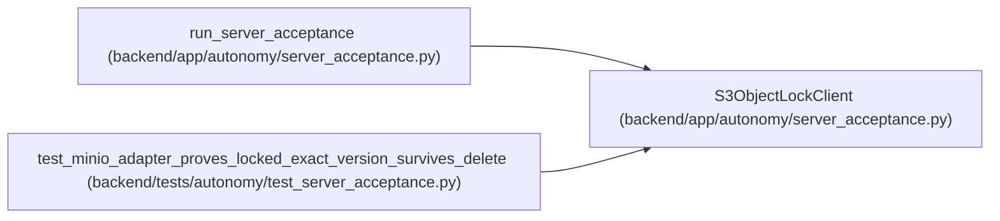

# S3ObjectLockClient

**Location:** `backend/app/autonomy/server_acceptance.py:459`
**Kind:** Class
**Bases:** —
**Module:** [autonomy_server_acceptance](../modules/autonomy_server_acceptance.md)

## Description

Path-style S3 client with only the operations required by acceptance.

## Attributes

*No annotated attributes found.*

## Methods

| Method | Signature | Decorators | Description |
|--------|-----------|------------|-------------|
| `__init__` | `(*, endpoint: str, access_key: str, secret_key: str, region: str, timeout_seconds: float, client: httpx.Client \| None = None) -> None` | — | — |
| `close` | `() -> None` | — | — |
| `probe_ready` | `(bucket: str) -> ObjectStoreAcceptance` | — | — |
| `store_locked` | `(*, bucket: str, object_key: str, payload: bytes, evaluated_at: datetime) -> LockedAcceptanceObject` | — | — |
| `_request` | `(method: str, *, bucket: str, object_key: str, body: bytes = b'', params: tuple[tuple[str, str], ...] = (), headers: dict[str, str] \| None = None, now: datetime \| None = None) -> httpx.Response` | — | — |

## Relationships

<!-- Auto-generated relationship summary. Do not edit by hand. -->

### Summary

| Module | Methods | Attributes |
|---|---:|---|
| [autonomy_server_acceptance](../modules/autonomy_server_acceptance.md) | 5 | — |

### References

| Reference | Kind | Source | Call sites |
|---|---|---|---:|
| `run_server_acceptance` | call | [autonomy_server_acceptance](../modules/autonomy_server_acceptance.md) | 1 |
| `test_minio_adapter_proves_locked_exact_version_survives_delete` | call | [test_server_acceptance](../modules/test_server_acceptance.md) | 1 |
