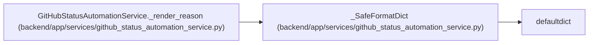

# _SafeFormatDict

**Location:** `backend/app/services/github_status_automation_service.py:68`
**Kind:** Class
**Bases:** `defaultdict`
**Module:** [github_status_automation_service](../modules/github_status_automation_service.md)

## Description

Leave unknown reason-template placeholders readable.

## Attributes

*No annotated attributes found.*

## Methods

| Method | Signature | Decorators | Description |
|--------|-----------|------------|-------------|
| `__missing__` | `(key)` | — | — |

## Relationships

<!-- Auto-generated relationship summary. Do not edit by hand. -->

### Summary

| Module | Methods | Attributes |
|---|---:|---|
| [github_status_automation_service](../modules/github_status_automation_service.md) | 1 | — |

### Structure

| Kind | Entity | Module |
|---|---|---|
| Base | `defaultdict` | — |

### References

| Reference | Kind | Source | Call sites |
|---|---|---|---:|
| `GitHubStatusAutomationService._render_reason` | call | [github_status_automation_service](../modules/github_status_automation_service.md) | 1 |
