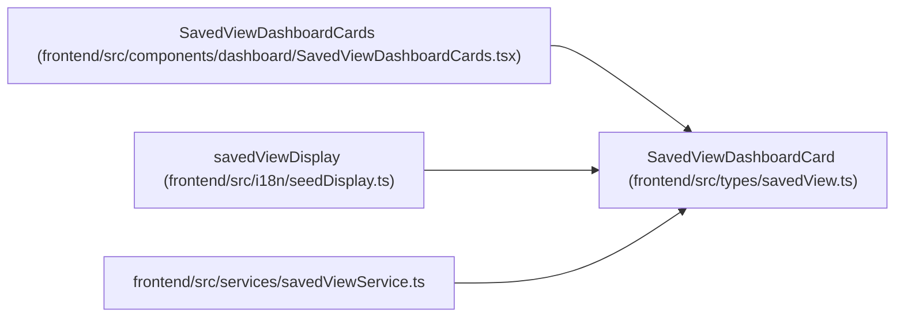

# SavedViewDashboardCard

**Location:** `frontend/src/types/savedView.ts:24`
**Kind:** Class
**Bases:** —
**Module:** [savedView](../modules/savedView.md)

## Description

_Auto-generated from `SavedViewDashboardCard` in `frontend/src/types/savedView.ts`._

## Attributes

| Name | Type | Required | Default | Description |
|------|------|----------|---------|-------------|
| `saved_view_id` | `number` | Yes | — | — |
| `seed_key` | `string` | Yes | — | — |
| `name` | `string` | Yes | — | — |
| `description` | `string \| null` | No | — | — |
| `view_type` | `SavedViewType` | Yes | — | — |
| `scope` | `SavedViewScope` | Yes | — | — |
| `count` | `number` | Yes | — | — |
| `target_path` | `string` | Yes | — | — |
| `is_valid` | `boolean` | Yes | — | — |
| `invalid_reason` | `string \| null` | No | — | — |

## Methods

*No public methods. Inherits from base classes.*

## Relationships

<!-- Auto-generated relationship summary. Do not edit by hand. -->

### Summary

| Module | Methods | Attributes |
|---|---:|---|
| [savedView](../modules/savedView.md) | 0 | `count`, `description`, `invalid_reason`, `is_valid`, `name`, `saved_view_id`, `scope`, `seed_key`, `target_path`, `view_type` |

### References

| Reference | Kind | Source | Call sites |
|---|---|---|---:|
| `SavedViewDashboardCards` | type_reference | [SavedViewDashboardCards](../modules/SavedViewDashboardCards.md) | — |
| `savedViewDisplay` | type_reference | [seedDisplay](../modules/seedDisplay.md) | — |
| `savedViewService` | import | [savedViewService](../modules/savedViewService.md) | — |
