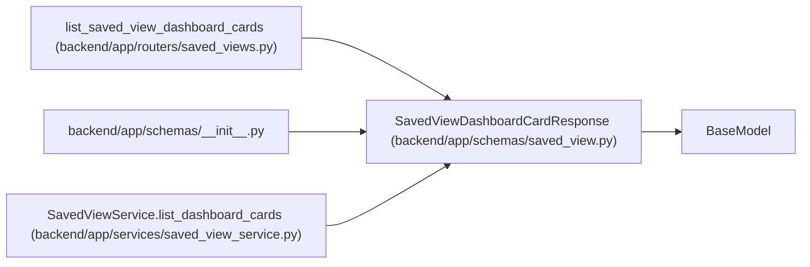

# SavedViewDashboardCardResponse

**Location:** `backend/app/schemas/saved_view.py:127`
**Kind:** Pydantic model
**Bases:** `BaseModel`
**Module:** [schemas_saved_view](../modules/schemas_saved_view.md)

## Description

Dashboard card summary backed by a saved view.

## Attributes

| Name | Type | Wire name | Required | Nullable | Default | Constraints | Examples | Description |
|------|------|-----------|----------|----------|---------|-------------|-------------|----------|
| `saved_view_id` | `int` | `saved_view_id` | Yes | No | — | — | — | — |
| `seed_key` | `str` | `seed_key` | Yes | No | — | — | — | — |
| `name` | `str` | `name` | Yes | No | — | — | — | — |
| `description` | `Optional[str]` | `description` | No | Yes | `None` | — | — | — |
| `view_type` | `str` | `view_type` | Yes | No | — | — | — | — |
| `scope` | `str` | `scope` | Yes | No | — | — | — | — |
| `count` | `int` | `count` | Yes | No | — | — | — | — |
| `target_path` | `str` | `target_path` | Yes | No | — | — | — | — |
| `is_valid` | `bool` | `is_valid` | No | No | `True` | — | — | — |
| `invalid_reason` | `Optional[str]` | `invalid_reason` | No | Yes | `None` | — | — | — |

## Methods

*No public methods. Inherits from base classes.*

## Relationships

<!-- Auto-generated relationship summary. Do not edit by hand. -->

### Summary

| Module | Methods | Attributes |
|---|---:|---|
| [schemas_saved_view](../modules/schemas_saved_view.md) | 0 | `count`, `description`, `invalid_reason`, `is_valid`, `name`, `saved_view_id`, `scope`, `seed_key`, `target_path`, `view_type` |

### Structure

| Kind | Entity | Module |
|---|---|---|
| Base | `BaseModel` | — |

### References

| Reference | Kind | Source | Call sites |
|---|---|---|---:|
| `list_saved_view_dashboard_cards` | type_reference | [saved_views](../modules/saved_views.md) | — |
| `__init__` | import | [schemas___init__](../modules/schemas___init__.md) | — |
| `SavedViewService.list_dashboard_cards` | call | [saved_view_service](../modules/saved_view_service.md) | 1 |
| `SavedViewService.list_dashboard_cards` | type_reference | [saved_view_service](../modules/saved_view_service.md) | — |
