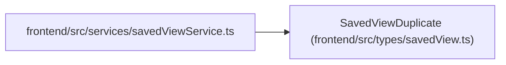

# SavedViewDuplicate

**Location:** `frontend/src/types/savedView.ts:63`
**Kind:** Class
**Bases:** —
**Module:** [savedView](../modules/savedView.md)

## Description

_Auto-generated from `SavedViewDuplicate` in `frontend/src/types/savedView.ts`._

## Attributes

| Name | Type | Required | Default | Description |
|------|------|----------|---------|-------------|
| `name` | `string` | No | — | — |
| `description` | `string \| null` | No | — | — |
| `scope` | `Exclude<SavedViewScope, 'system'>` | No | — | — |

## Methods

*No public methods. Inherits from base classes.*

## Relationships

<!-- Auto-generated relationship summary. Do not edit by hand. -->

### Summary

| Module | Methods | Attributes |
|---|---:|---|
| [savedView](../modules/savedView.md) | 0 | `description`, `name`, `scope` |

### References

| Reference | Kind | Source | Call sites |
|---|---|---|---:|
| `savedViewService` | import | [savedViewService](../modules/savedViewService.md) | — |
