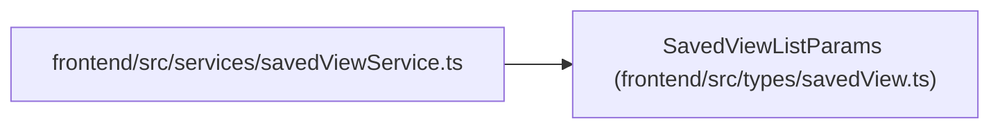

# SavedViewListParams

**Location:** `frontend/src/types/savedView.ts:37`
**Kind:** Class
**Bases:** —
**Module:** [savedView](../modules/savedView.md)

## Description

_Auto-generated from `SavedViewListParams` in `frontend/src/types/savedView.ts`._

## Attributes

| Name | Type | Required | Default | Description |
|------|------|----------|---------|-------------|
| `view_type` | `SavedViewType` | Yes | — | — |

## Methods

*No public methods. Inherits from base classes.*

## Relationships

<!-- Auto-generated relationship summary. Do not edit by hand. -->

### Summary

| Module | Methods | Attributes |
|---|---:|---|
| [savedView](../modules/savedView.md) | 0 | `view_type` |

### References

| Reference | Kind | Source | Call sites |
|---|---|---|---:|
| `savedViewService` | import | [savedViewService](../modules/savedViewService.md) | — |
