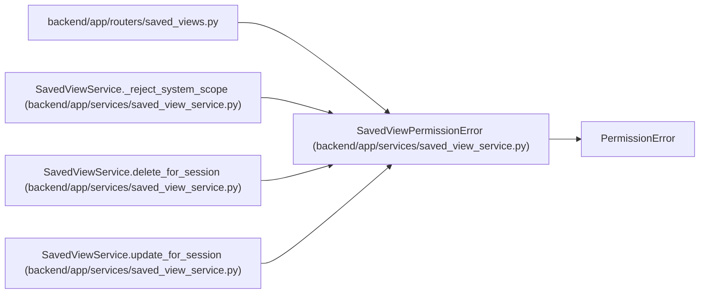

# SavedViewPermissionError

**Location:** `backend/app/services/saved_view_service.py:24`
**Kind:** Class
**Bases:** `PermissionError`
**Module:** [saved_view_service](../modules/saved_view_service.md)

## Description

Raised when a session cannot mutate a saved view.

## Attributes

*No annotated attributes found.*

## Methods

*No public methods. Inherits from base classes.*

## Relationships

<!-- Auto-generated relationship summary. Do not edit by hand. -->

### Summary

| Module | Methods | Attributes |
|---|---:|---|
| [saved_view_service](../modules/saved_view_service.md) | 0 | — |

### Structure

| Kind | Entity | Module |
|---|---|---|
| Base | `PermissionError` | — |

### References

| Reference | Kind | Source | Call sites |
|---|---|---|---:|
| `saved_views` | import | [saved_views](../modules/saved_views.md) | — |
| `SavedViewService._reject_system_scope` | call | [saved_view_service](../modules/saved_view_service.md) | 1 |
| `SavedViewService.delete_for_session` | call | [saved_view_service](../modules/saved_view_service.md) | 1 |
| `SavedViewService.update_for_session` | call | [saved_view_service](../modules/saved_view_service.md) | 1 |
