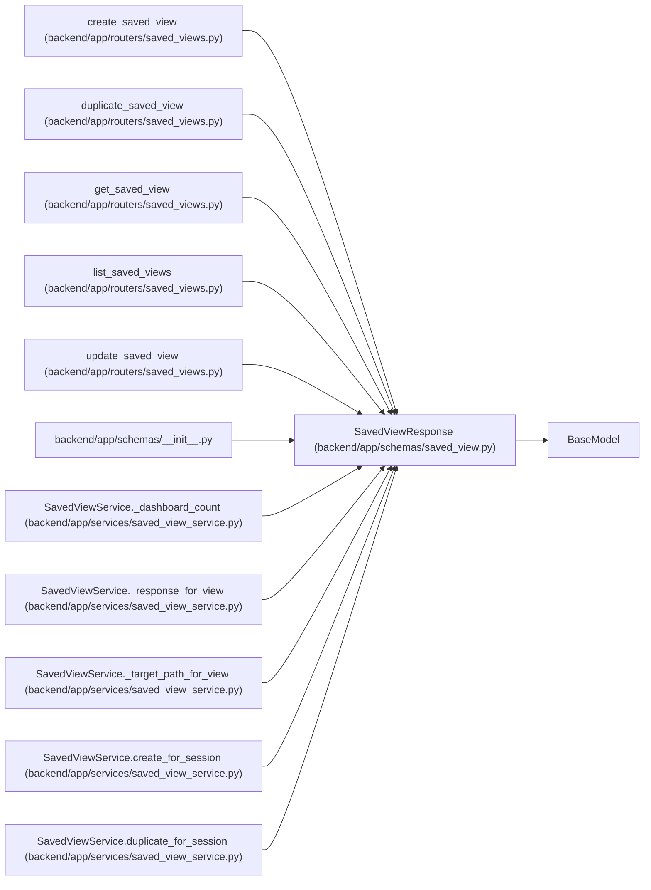

# SavedViewResponse

**Location:** `backend/app/schemas/saved_view.py:104`
**Kind:** Pydantic model
**Bases:** `BaseModel`
**Module:** [schemas_saved_view](../modules/schemas_saved_view.md)

## Description

Schema for saved view responses.

## Model Configuration

| Setting | Value | Source |
|---------|-------|--------|
| `from_attributes` | `True` | model_config |

## Attributes

| Name | Type | Wire name | Required | Nullable | Default | Constraints | Examples | Description |
|------|------|-----------|----------|----------|---------|-------------|-------------|----------|
| `id` | `int` | `id` | Yes | No | — | — | — | — |
| `name` | `str` | `name` | Yes | No | — | — | — | — |
| `description` | `Optional[str]` | `description` | No | Yes | `None` | — | — | — |
| `seed_key` | `Optional[str]` | `seed_key` | No | Yes | `None` | — | — | — |
| `view_type` | `str` | `view_type` | Yes | No | — | — | — | — |
| `scope` | `str` | `scope` | Yes | No | — | — | — | — |
| `filters_json` | `dict[str, Any]` | `filters_json` | No | No | factory: `dict` | — | — | — |
| `sort_json` | `dict[str, Any]` | `sort_json` | No | No | factory: `dict` | — | — | — |
| `columns_json` | `dict[str, Any]` | `columns_json` | No | No | factory: `dict` | — | — | — |
| `created_by_session_id` | `Optional[int]` | `created_by_session_id` | No | Yes | `None` | — | — | — |
| `schema_version` | `int` | `schema_version` | Yes | No | — | — | — | — |
| `metric_migration_note` | `str \| None` | `metric_migration_note` | No | Yes | `None` | — | — | — |
| `owner_principal_id` | `int \| None` | `owner_principal_id` | No | Yes | `None` | — | — | — |
| `is_valid` | `bool` | `is_valid` | No | No | `True` | — | — | — |
| `invalid_reason` | `Optional[str]` | `invalid_reason` | No | Yes | `None` | — | — | — |
| `created_at` | `datetime` | `created_at` | Yes | No | — | — | — | — |
| `updated_at` | `datetime` | `updated_at` | Yes | No | — | — | — | — |

## Methods

*No public methods. Inherits from base classes.*

## Relationships

<!-- Auto-generated relationship summary. Do not edit by hand. -->

### Summary

| Module | Methods | Attributes |
|---|---:|---|
| [schemas_saved_view](../modules/schemas_saved_view.md) | 0 | `columns_json`, `created_at`, `created_by_session_id`, `description`, `filters_json`, `id`, `invalid_reason`, `is_valid`, `metric_migration_note`, `name`, `owner_principal_id`, `schema_version` |

### Structure

| Kind | Entity | Module |
|---|---|---|
| Base | `BaseModel` | — |

### References

| Reference | Kind | Source | Call sites |
|---|---|---|---:|
| `create_saved_view` | type_reference | [saved_views](../modules/saved_views.md) | — |
| `duplicate_saved_view` | type_reference | [saved_views](../modules/saved_views.md) | — |
| `get_saved_view` | type_reference | [saved_views](../modules/saved_views.md) | — |
| `list_saved_views` | type_reference | [saved_views](../modules/saved_views.md) | — |
| `update_saved_view` | type_reference | [saved_views](../modules/saved_views.md) | — |
| `__init__` | import | [schemas___init__](../modules/schemas___init__.md) | — |
| `SavedViewService._dashboard_count` | type_reference | [saved_view_service](../modules/saved_view_service.md) | — |
| `SavedViewService._response_for_view` | call | [saved_view_service](../modules/saved_view_service.md) | 1 |
| `SavedViewService._response_for_view` | type_reference | [saved_view_service](../modules/saved_view_service.md) | — |
| `SavedViewService._target_path_for_view` | type_reference | [saved_view_service](../modules/saved_view_service.md) | — |
| `SavedViewService.create_for_session` | type_reference | [saved_view_service](../modules/saved_view_service.md) | — |
| `SavedViewService.duplicate_for_session` | type_reference | [saved_view_service](../modules/saved_view_service.md) | — |

> References: showing 12 of 15 logical references; 3 omitted by the 12-row generated summary limit.
