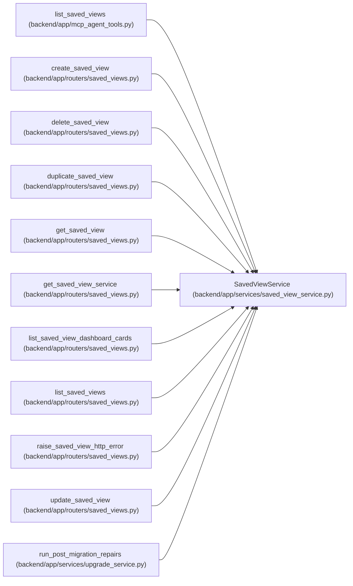

# SavedViewService

**Location:** `backend/app/services/saved_view_service.py:174`
**Kind:** Class
**Bases:** —
**Module:** [saved_view_service](../modules/saved_view_service.md)

## Description

Service for saved view CRUD and compatibility-safe read models.

## Attributes

*No annotated attributes found.*

## Methods

| Method | Signature | Decorators | Description |
|--------|-----------|------------|-------------|
| `__init__` | `(db: AsyncSession)` | — | — |
| `_enum_value` | `(value)` | — | Normalize Pydantic enum values before assigning to string columns. |
| `_query` | `() -> Select` | — | Build the base saved view query. |
| `_require_personal_creator` | `(scope: SavedViewScope \| str, session_id: Optional[int]) -> None` | — | — |
| `_require_object` | `(value: Any, field_name: str) -> dict[str, Any]` | — | — |
| `_normalize_nullable_int` | `(value: Any, field_name: str, minimum: Optional[int] = None, maximum: Optional[int] = None) -> Optional[int]` | — | — |
| `_normalize_nullable_bool` | `(value: Any, field_name: str) -> Optional[bool]` | — | — |
| `_normalize_bool` | `(value: Any, field_name: str) -> bool` | — | — |
| `_normalize_string` | `(value: Any, field_name: str) -> str` | — | — |
| `_normalize_enum_string_or_empty` | `(value: Any, field_name: str, allowed_values: set[str]) -> str` | — | — |
| `_normalize_date_string` | `(value: Any, field_name: str) -> str` | — | — |
| `_normalize_string_list` | `(value: Any, field_name: str) -> list[str]` | — | — |
| `_normalize_task_filters` | `(filters: dict[str, Any]) -> tuple[dict[str, Any], bool, Optional[str]]` | — | — |
| `_normalize_project_filters` | `(filters: dict[str, Any]) -> tuple[dict[str, Any], bool, Optional[str]]` | — | — |
| `_normalize_triage_filters` | `(filters: dict[str, Any]) -> tuple[dict[str, Any], bool, Optional[str]]` | — | — |
| `normalize_filters` | `(view_type: SavedViewType \| str, filters: Any) -> tuple[dict[str, Any], bool, Optional[str]]` | — | Normalize known filter fields and ignore unknown future keys. |
| `normalize_sort` | `(view_type: SavedViewType \| str, sort_json: Any) -> tuple[dict[str, Any], bool, Optional[str]]` | — | Normalize sort settings for known view surfaces. |
| `_valid_object_or_empty` | `(value: Any, field_name: str) -> tuple[dict[str, Any], Optional[str]]` | — | — |
| `_response_for_view` | `(view: SavedView) -> SavedViewResponse` | — | — |
| `get_by_id` | *(async)* `(view_id: int) -> Optional[SavedView]` | — | Get a saved view by ID. |
| `_normalized_system_definition` | `(definition: dict[str, Any]) -> dict[str, Any]` | — | Build a validated saved view row from a built-in definition. |
| `seed_default_views` | *(async)* `() -> list[SavedView]` | — | Insert or refresh built-in system saved views. |
| `_target_path_for_view` | `(view: SavedViewResponse) -> str` | — | Return the frontend route that opens a saved view. |
| `_active_label_group_slugs` | *(async)* `() -> dict[str, set[str]]` | — | Map active label group keys to their active label slugs. |
| `_task_child_filters_for_assignee` | `(filters: dict[str, Any]) -> dict[str, Any]` | — | — |
| `_task_child_filters_for_project` | `(filters: dict[str, Any]) -> dict[str, Any]` | — | — |
| `_task_has_any_tag` | `(task: Any, selected_tags: set[str]) -> bool` | — | — |
| `_task_date_value` | `(value: Any) -> str` | — | — |
| `_task_matches_planning_issue` | `(task: Any, planning_issue: Optional[str]) -> bool` | — | — |
| `_task_matches_filters` | `(task: Any, filters: dict[str, Any], label_group_slugs: dict[str, set[str]]) -> bool` | — | — |
| `_task_filter_includes_row` | `(task: Any, filters: dict[str, Any], label_group_slugs: dict[str, set[str]]) -> bool` | — | — |
| `_count_task_dashboard_view` | *(async)* `(filters: dict[str, Any], iteration: Iteration) -> int` | — | — |
| `_count_project_dashboard_view` | *(async)* `(filters: dict[str, Any]) -> int` | — | — |
| `_count_triage_dashboard_view` | *(async)* `(filters: dict[str, Any]) -> int` | — | — |
| `_dashboard_count` | *(async)* `(view: SavedViewResponse, iteration: Iteration) -> int` | — | — |
| `list_dashboard_cards` | *(async)* `(iteration_id: int, session_id: Optional[int]) -> Optional[list[SavedViewDashboardCardResponse]]` | — | Build system saved-view dashboard cards visible to a session. |
| `create` | *(async)* `(data: SavedViewCreate) -> SavedView` | — | Create a saved view after scope and filter validation. |
| `update` | *(async)* `(view_id: int, data: SavedViewUpdate) -> Optional[SavedView]` | — | Apply a saved view update after scope and filter validation. |
| `list_visible` | *(async)* `(view_type: SavedViewType \| str, session_id: Optional[int]) -> Sequence[SavedViewResponse]` | — | List views visible to a session for a given surface. |
| `_is_visible_to_session` | `(view: SavedView, session_id: Optional[int]) -> bool` | — | — |
| `_can_write` | `(view: SavedView, session_id: Optional[int]) -> bool` | — | — |
| `get_visible_model` | *(async)* `(view_id: int, session_id: Optional[int]) -> Optional[SavedView]` | — | Get a saved view model only when it is visible to the session. |
| `get_visible_by_id` | *(async)* `(view_id: int, session_id: Optional[int]) -> Optional[SavedViewResponse]` | — | Get a saved view response only when it is visible to the session. |
| `_reject_system_scope` | `(scope: SavedViewScope \| str) -> None` | — | — |
| `create_for_session` | *(async)* `(data: SavedViewCreateRequest, session_id: int) -> SavedViewResponse` | — | Create a user-owned saved view from a public API payload. |
| `update_for_session` | *(async)* `(view_id: int, data: SavedViewUpdateRequest, session_id: int) -> Optional[SavedViewResponse]` | — | Update a saved view when the caller owns it. |
| `delete_for_session` | *(async)* `(view_id: int, session_id: int) -> bool` | — | Delete a saved view when the caller owns it. |
| `duplicate_for_session` | *(async)* `(view_id: int, data: SavedViewDuplicateRequest, session_id: int) -> Optional[SavedViewResponse]` | — | Create a user-owned copy of any valid visible saved view. |

## Relationships

<!-- Auto-generated relationship summary. Do not edit by hand. -->

### Summary

| Module | Methods | Attributes |
|---|---:|---|
| [saved_view_service](../modules/saved_view_service.md) | 48 | — |

### References

| Reference | Kind | Source | Call sites |
|---|---|---|---:|
| `list_saved_views` | call | [mcp_agent_tools](../modules/mcp_agent_tools.md) | 1 |
| `create_saved_view` | type_reference | [saved_views](../modules/saved_views.md) | — |
| `delete_saved_view` | type_reference | [saved_views](../modules/saved_views.md) | — |
| `duplicate_saved_view` | type_reference | [saved_views](../modules/saved_views.md) | — |
| `get_saved_view` | type_reference | [saved_views](../modules/saved_views.md) | — |
| `get_saved_view_service` | call | [saved_views](../modules/saved_views.md) | 1 |
| `get_saved_view_service` | type_reference | [saved_views](../modules/saved_views.md) | — |
| `list_saved_view_dashboard_cards` | type_reference | [saved_views](../modules/saved_views.md) | — |
| `list_saved_views` | type_reference | [saved_views](../modules/saved_views.md) | — |
| `raise_saved_view_http_error` | type_reference | [saved_views](../modules/saved_views.md) | — |
| `update_saved_view` | type_reference | [saved_views](../modules/saved_views.md) | — |
| `run_post_migration_repairs` | call | [upgrade_service](../modules/upgrade_service.md) | 1 |

> References: showing 12 of 16 logical references; 4 omitted by the 12-row generated summary limit.
