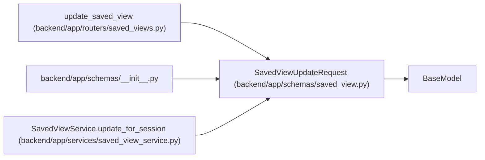

# SavedViewUpdateRequest

**Location:** `backend/app/schemas/saved_view.py:81`
**Kind:** Pydantic model
**Bases:** `BaseModel`
**Module:** [schemas_saved_view](../modules/schemas_saved_view.md)

## Description

Public API payload for updating a saved view.

## Model Configuration

| Setting | Value | Source |
|---------|-------|--------|
| `extra` | `'forbid'` | model_config |

## Attributes

| Name | Type | Wire name | Required | Nullable | Default | Constraints | Examples | Description |
|------|------|-----------|----------|----------|---------|-------------|-------------|----------|
| `name` | `Optional[str]` | `name` | No | Yes | `None` | max_length=255; min_length=1 | — | — |
| `description` | `Optional[str]` | `description` | No | Yes | `None` | — | — | — |
| `view_type` | `Optional[SavedViewType]` | `view_type` | No | Yes | `None` | — | — | — |
| `scope` | `Optional[SavedViewScope]` | `scope` | No | Yes | `None` | — | — | — |
| `filters_json` | `Any` | `filters_json` | No | No | `None` | — | — | — |
| `sort_json` | `Any` | `sort_json` | No | No | `None` | — | — | — |
| `columns_json` | `Any` | `columns_json` | No | No | `None` | — | — | — |
| `schema_version` | `Optional[int]` | `schema_version` | No | Yes | `None` | ge=1 | — | — |

## Methods

*No public methods. Inherits from base classes.*

## Relationships

<!-- Auto-generated relationship summary. Do not edit by hand. -->

### Summary

| Module | Methods | Attributes |
|---|---:|---|
| [schemas_saved_view](../modules/schemas_saved_view.md) | 0 | `columns_json`, `description`, `filters_json`, `name`, `schema_version`, `scope`, `sort_json`, `view_type` |

### Structure

| Kind | Entity | Module |
|---|---|---|
| Base | `BaseModel` | — |

### References

| Reference | Kind | Source | Call sites |
|---|---|---|---:|
| `update_saved_view` | type_reference | [saved_views](../modules/saved_views.md) | — |
| `__init__` | import | [schemas___init__](../modules/schemas___init__.md) | — |
| `SavedViewService.update_for_session` | type_reference | [saved_view_service](../modules/saved_view_service.md) | — |
