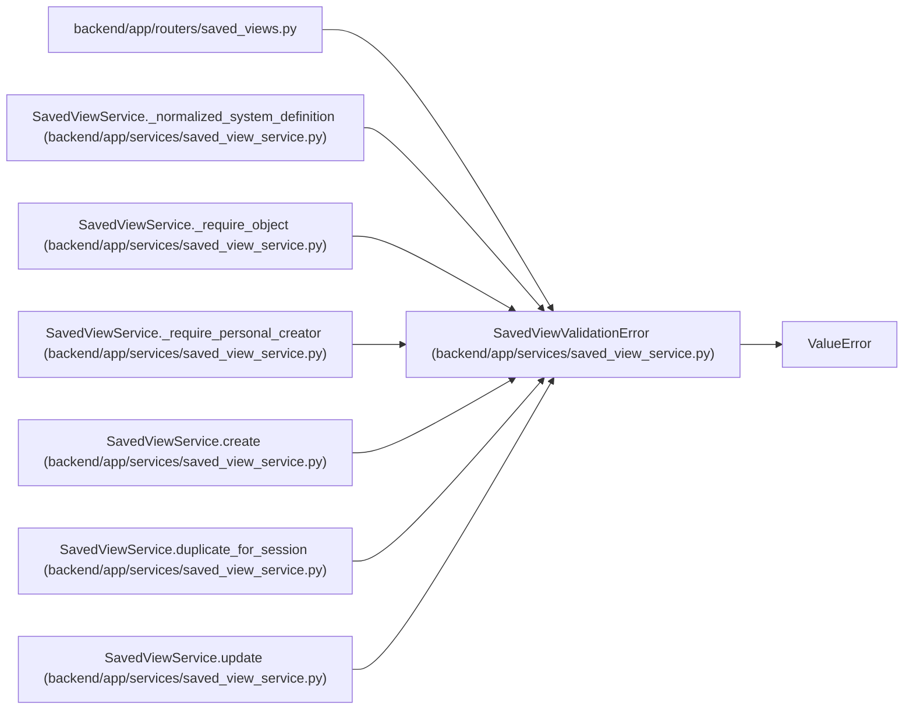

# SavedViewValidationError

**Location:** `backend/app/services/saved_view_service.py:30`
**Kind:** Class
**Bases:** `ValueError`
**Module:** [saved_view_service](../modules/saved_view_service.md)

## Description

Raised when a saved view payload is invalid.

## Attributes

*No annotated attributes found.*

## Methods

*No public methods. Inherits from base classes.*

## Relationships

<!-- Auto-generated relationship summary. Do not edit by hand. -->

### Summary

| Module | Methods | Attributes |
|---|---:|---|
| [saved_view_service](../modules/saved_view_service.md) | 0 | — |

### Structure

| Kind | Entity | Module |
|---|---|---|
| Base | `ValueError` | — |

### References

| Reference | Kind | Source | Call sites |
|---|---|---|---:|
| `saved_views` | import | [saved_views](../modules/saved_views.md) | — |
| `SavedViewService._normalized_system_definition` | call | [saved_view_service](../modules/saved_view_service.md) | 2 |
| `SavedViewService._require_object` | call | [saved_view_service](../modules/saved_view_service.md) | 1 |
| `SavedViewService._require_personal_creator` | call | [saved_view_service](../modules/saved_view_service.md) | 1 |
| `SavedViewService.create` | call | [saved_view_service](../modules/saved_view_service.md) | 2 |
| `SavedViewService.duplicate_for_session` | call | [saved_view_service](../modules/saved_view_service.md) | 1 |
| `SavedViewService.update` | call | [saved_view_service](../modules/saved_view_service.md) | 2 |
