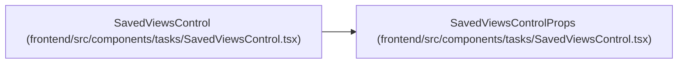

# SavedViewsControlProps

**Location:** `frontend/src/components/tasks/SavedViewsControl.tsx:24`
**Kind:** Class
**Bases:** —
**Module:** [SavedViewsControl](../modules/SavedViewsControl.md)

## Description

_Auto-generated from `SavedViewsControlProps` in `frontend/src/components/tasks/SavedViewsControl.tsx`._

## Attributes

| Name | Type | Default | Description |
|------|------|---------|-------------|
| `filters` | `TaskFilters` | *required* | — |
| `sortKey` | `SortKey` | *required* | — |
| `selectedViewId` | `number \| null` | *required* | — |
| `onSelectedViewIdChange` | `(viewId: number \| null) => void` | *required* | — |
| `onApplyView` | `(view: SavedView) => void` | *required* | — |

## Methods

*No public methods. Inherits from base classes.*

## Relationships

<!-- Auto-generated relationship summary. Do not edit by hand. -->

### Summary

| Module | Methods | Attributes |
|---|---:|---|
| [SavedViewsControl](../modules/SavedViewsControl.md) | 0 | `filters`, `onApplyView`, `onSelectedViewIdChange`, `selectedViewId`, `sortKey` |

### References

| Reference | Kind | Source | Call sites |
|---|---|---|---:|
| `SavedViewsControl` | type_reference | [SavedViewsControl](../modules/SavedViewsControl.md) | — |
