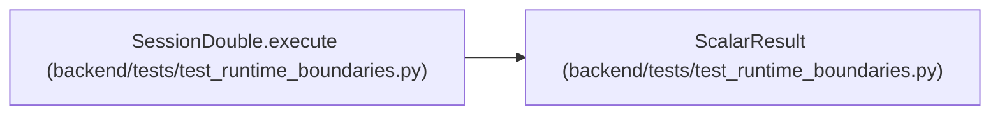

# ScalarResult

**Location:** `backend/tests/test_runtime_boundaries.py:36`
**Kind:** Class
**Bases:** —
**Module:** [test_runtime_boundaries](../modules/test_runtime_boundaries.md)

## Description

_Auto-generated from `ScalarResult` in `backend/tests/test_runtime_boundaries.py`._

## Attributes

*No annotated attributes found.*

## Methods

| Method | Signature | Decorators | Description |
|--------|-----------|------------|-------------|
| `__init__` | `(value: Any)` | — | — |
| `scalar_one_or_none` | `() -> Any` | — | — |

## Relationships

<!-- Auto-generated relationship summary. Do not edit by hand. -->

### Summary

| Module | Methods | Attributes |
|---|---:|---|
| [test_runtime_boundaries](../modules/test_runtime_boundaries.md) | 2 | — |

### References

| Reference | Kind | Source | Call sites |
|---|---|---|---:|
| `SessionDouble.execute` | call | [test_runtime_boundaries](../modules/test_runtime_boundaries.md) | 1 |
| `SessionDouble.execute` | type_reference | [test_runtime_boundaries](../modules/test_runtime_boundaries.md) | — |
