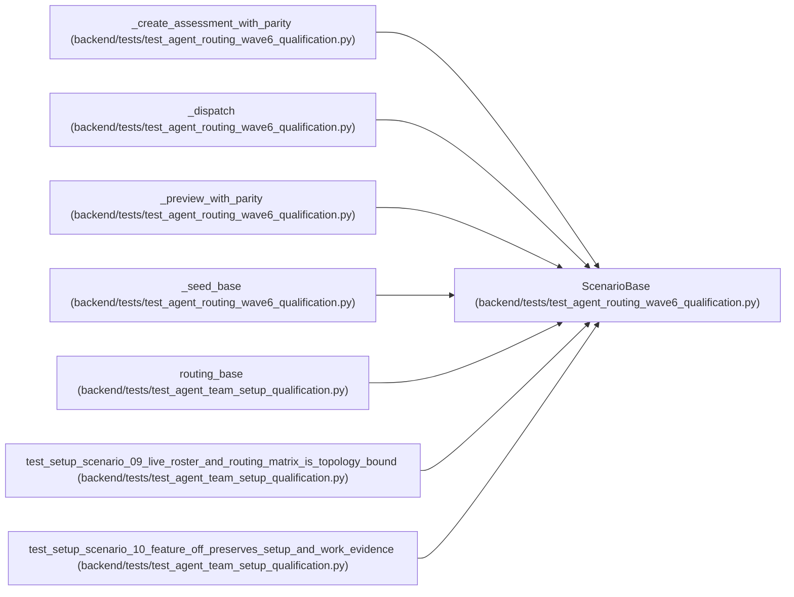

# ScenarioBase

**Location:** `backend/tests/test_agent_routing_wave6_qualification.py:86`
**Kind:** Class
**Bases:** —
**Module:** [test_agent_routing_wave6_qualification](../modules/test_agent_routing_wave6_qualification.md)

**Decorators:** `@dataclass(frozen=True)`

## Description

_Auto-generated from `ScenarioBase` in `backend/tests/test_agent_routing_wave6_qualification.py`._

## Attributes

| Name | Type | Default | Description |
|------|------|---------|-------------|
| `pm` | `AgentActor` | *required* | — |
| `task` | `Task` | *required* | — |
| `profile` | `TeamMemberProfile` | *required* | — |
| `member` | `TeamMember` | *required* | — |

## Methods

*No public methods. Inherits from base classes.*

## Relationships

<!-- Auto-generated relationship summary. Do not edit by hand. -->

### Summary

| Module | Methods | Attributes |
|---|---:|---|
| [test_agent_routing_wave6_qualification](../modules/test_agent_routing_wave6_qualification.md) | 0 | `member`, `pm`, `profile`, `task` |

### References

| Reference | Kind | Source | Call sites |
|---|---|---|---:|
| `_create_assessment_with_parity` | type_reference | [test_agent_routing_wave6_qualification](../modules/test_agent_routing_wave6_qualification.md) | — |
| `_dispatch` | type_reference | [test_agent_routing_wave6_qualification](../modules/test_agent_routing_wave6_qualification.md) | — |
| `_preview_with_parity` | type_reference | [test_agent_routing_wave6_qualification](../modules/test_agent_routing_wave6_qualification.md) | — |
| `_seed_base` | call | [test_agent_routing_wave6_qualification](../modules/test_agent_routing_wave6_qualification.md) | 1 |
| `_seed_base` | type_reference | [test_agent_routing_wave6_qualification](../modules/test_agent_routing_wave6_qualification.md) | — |
| `routing_base` | call | [test_agent_team_setup_qualification](../modules/test_agent_team_setup_qualification.md) | 1 |
| `routing_base` | type_reference | [test_agent_team_setup_qualification](../modules/test_agent_team_setup_qualification.md) | — |
| `test_setup_scenario_09_live_roster_and_routing_matrix_is_topology_bound` | call | [test_agent_team_setup_qualification](../modules/test_agent_team_setup_qualification.md) | 1 |
| `test_setup_scenario_10_feature_off_preserves_setup_and_work_evidence` | call | [test_agent_team_setup_qualification](../modules/test_agent_team_setup_qualification.md) | 1 |
