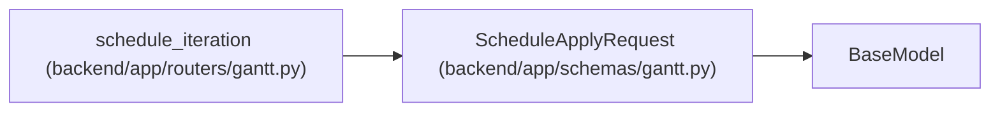

# ScheduleApplyRequest

**Location:** `backend/app/schemas/gantt.py:95`
**Kind:** Pydantic model
**Bases:** `BaseModel`
**Module:** [schemas_gantt](../modules/schemas_gantt.md)

## Description

_Auto-generated from `ScheduleApplyRequest` in `backend/app/schemas/gantt.py`._

## Attributes

| Name | Type | Wire name | Required | Nullable | Default | Constraints | Examples | Description |
|------|------|-----------|----------|----------|---------|-------------|-------------|----------|
| `expected_revision` | `Optional[int]` | `expected_revision` | No | Yes | `None` | — | — | — |
| `rebaseline_reason` | `Optional[str]` | `rebaseline_reason` | No | Yes | `None` | — | — | — |

## Methods

*No public methods. Inherits from base classes.*

## Relationships

<!-- Auto-generated relationship summary. Do not edit by hand. -->

### Summary

| Module | Methods | Attributes |
|---|---:|---|
| [schemas_gantt](../modules/schemas_gantt.md) | 0 | `expected_revision`, `rebaseline_reason` |

### Structure

| Kind | Entity | Module |
|---|---|---|
| Base | `BaseModel` | — |

### References

| Reference | Kind | Source | Call sites |
|---|---|---|---:|
| `schedule_iteration` | type_reference | [routers_gantt](../modules/routers_gantt.md) | — |
