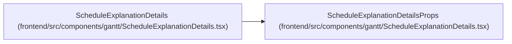

# ScheduleExplanationDetailsProps

**Location:** `frontend/src/components/gantt/ScheduleExplanationDetails.tsx:12`
**Kind:** Class
**Bases:** —
**Module:** [ScheduleExplanationDetails](../modules/ScheduleExplanationDetails.md)

## Description

_Auto-generated from `ScheduleExplanationDetailsProps` in `frontend/src/components/gantt/ScheduleExplanationDetails.tsx`._

## Attributes

| Name | Type | Required | Default | Description |
|------|------|----------|---------|-------------|
| `decisions` | `ScheduleDecisionExplanation[]` | Yes | — | — |
| `taskLookup` | `Map<number, GanttTask>` | Yes | — | — |
| `memberVacations` | `Record<number, string[]>` | Yes | — | — |
| `workloadBalanced` | `boolean` | Yes | — | — |
| `workloadIssues` | `string[]` | Yes | — | — |
| `onOpenTask` | `(task: GanttTask) => void` | Yes | — | — |

## Methods

*No public methods. Inherits from base classes.*

## Relationships

<!-- Auto-generated relationship summary. Do not edit by hand. -->

### Summary

| Module | Methods | Attributes |
|---|---:|---|
| [ScheduleExplanationDetails](../modules/ScheduleExplanationDetails.md) | 0 | `decisions`, `memberVacations`, `onOpenTask`, `taskLookup`, `workloadBalanced`, `workloadIssues` |

### References

| Reference | Kind | Source | Call sites |
|---|---|---|---:|
| `ScheduleExplanationDetails` | type_reference | [ScheduleExplanationDetails](../modules/ScheduleExplanationDetails.md) | — |
