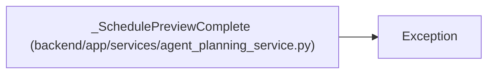

# _SchedulePreviewComplete

**Location:** `backend/app/services/agent_planning_service.py:70`
**Kind:** Class
**Bases:** `Exception`
**Module:** [agent_planning_service](../modules/agent_planning_service.md)

## Description

Internal signal used to roll back a schedule preview savepoint.

## Attributes

*No annotated attributes found.*

## Methods

| Method | Signature | Decorators | Description |
|--------|-----------|------------|-------------|
| `__init__` | `(result: dict[str, Any])` | — | — |

## Relationships

<!-- Auto-generated relationship summary. Do not edit by hand. -->

### Summary

| Module | Methods | Attributes |
|---|---:|---|
| [agent_planning_service](../modules/agent_planning_service.md) | 1 | — |

### Structure

| Kind | Entity | Module |
|---|---|---|
| Base | `Exception` | — |
