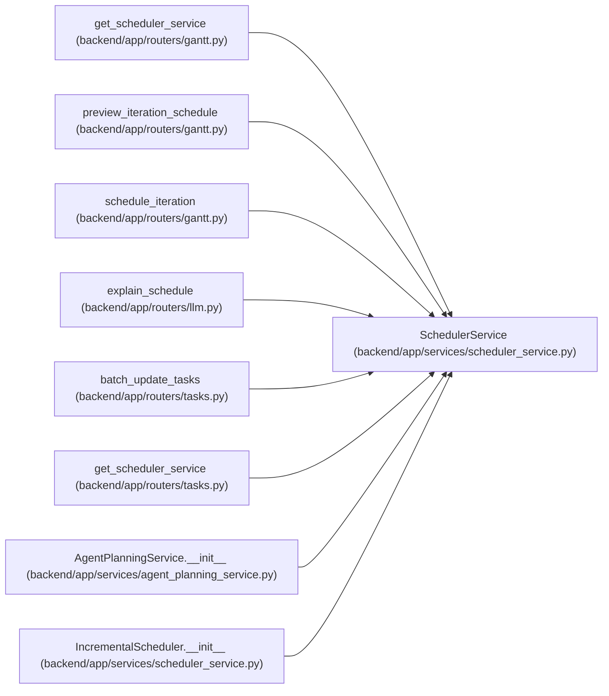

# SchedulerService

**Location:** `backend/app/services/scheduler_service.py:339`
**Kind:** Class
**Bases:** —
**Module:** [scheduler_service](../modules/scheduler_service.md)

## Description

Service for automatic task scheduling.

## Attributes

*No annotated attributes found.*

## Methods

| Method | Signature | Decorators | Description |
|--------|-----------|------------|-------------|
| `__init__` | `(db: AsyncSession)` | — | — |
| `schedule_iteration` | *(async)* `(iteration_id: int, *, commit: bool = True) -> ScheduleResult` | — | Schedule an iteration, optionally leaving commit ownership to the caller. |
| `_build_member_schedules` | *(async)* `(iteration: Iteration, team_members: Sequence[TeamMember]) -> dict[int, MemberSchedule]` | — | Build schedule tracking for each team member. |
| `_topological_sort` | `(tasks: list[Task]) -> list[Task]` | — | Sort tasks respecting dependencies. |
| `_topological_sort_children` | `(children: list[Task], child_ids: set[int]) -> list[Task]` | — | Sort child tasks respecting internal dependencies, then by (is_optional, priority). |
| `_get_dependency_depth` | `(task: Task, all_tasks: Sequence[Task]) -> int` | — | Get the depth of a task in dependency chain. |
| `_calculate_adjusted_effort` | `(task: Task) -> int` | — | Calculate adjusted effort days after applying assignee coefficients. |
| `_build_task_context` | `(task: Task, task_can_fit_before_vacation: dict[int, bool]) -> dict` | — | Build task context dictionary for YAML pass filters and sorting. |
| `_build_assignee_dependency_graph` | `(tasks: list[Task]) -> tuple[dict[int, set[int]], set[int]]` | — | Build cross-assignee dependency graph. |
| `_topological_sort_assignees` | `(assignee_deps: dict[int, set[int]]) -> list[set[int]]` | — | Group dependent assignees into levels for sequential processing. |
| `_schedule_leaf_task` | *(async)* `(task: Task, iteration: Iteration, member_schedules: dict[int, MemberSchedule], decisions: list[SchedulingDecision], task_map: dict[int, Task], earliest_start: Optional[date] = None)` | — | Schedule a leaf task (no children). |
| `_schedule_composite_task` | *(async)* `(task: Task, iteration: Iteration, member_schedules: dict[int, MemberSchedule], decisions: list[SchedulingDecision], task_map: dict[int, Task], parent_earliest_start: Optional[date] = None)` | — | Schedule a composite task (with children). |
| `_get_earliest_start` | `(task: Task, iteration_start: date, task_map: dict[int, Task]) -> date` | — | Get earliest possible start date based on dependencies. |
| `_update_composite_task_dates` | `(task: Task, iteration: Iteration, decisions: list[SchedulingDecision])` | — | Update a composite task's dates based on its children. |
| `_check_workload_balance` | `(member_schedules: dict[int, MemberSchedule]) -> list[WorkloadIssue]` | — | Check for workload imbalances. |

## Relationships

<!-- Auto-generated relationship summary. Do not edit by hand. -->

### Summary

| Module | Methods | Attributes |
|---|---:|---|
| [scheduler_service](../modules/scheduler_service.md) | 15 | — |

### References

| Reference | Kind | Source | Call sites |
|---|---|---|---:|
| `get_scheduler_service` | call | [routers_gantt](../modules/routers_gantt.md) | 1 |
| `get_scheduler_service` | type_reference | [routers_gantt](../modules/routers_gantt.md) | — |
| `preview_iteration_schedule` | type_reference | [routers_gantt](../modules/routers_gantt.md) | — |
| `schedule_iteration` | type_reference | [routers_gantt](../modules/routers_gantt.md) | — |
| `explain_schedule` | call | [routers_llm](../modules/routers_llm.md) | 1 |
| `batch_update_tasks` | type_reference | [tasks](../modules/tasks.md) | — |
| `get_scheduler_service` | call | [tasks](../modules/tasks.md) | 1 |
| `get_scheduler_service` | type_reference | [tasks](../modules/tasks.md) | — |
| `AgentPlanningService.__init__` | call | [agent_planning_service](../modules/agent_planning_service.md) | 1 |
| `IncrementalScheduler.__init__` | type_reference | [scheduler_service](../modules/scheduler_service.md) | — |
