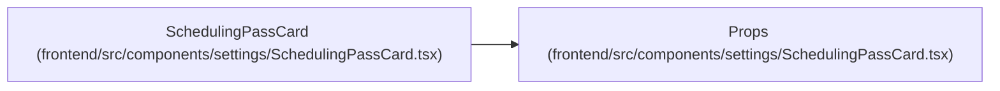

# Props

**Location:** `frontend/src/components/settings/SchedulingPassCard.tsx:12`
**Kind:** Class
**Bases:** —
**Module:** [SchedulingPassCard](../modules/SchedulingPassCard.md)

## Description

_Auto-generated from `Props` in `frontend/src/components/settings/SchedulingPassCard.tsx`._

## Attributes

| Name | Type | Default | Description |
|------|------|---------|-------------|
| `pass` | `SchedulingPass` | *required* | — |
| `sortableId` | `string` | *required* | — |
| `onChange` | `(pass: SchedulingPass) => void` | *required* | — |
| `onRemove` | `() => void` | *required* | — |

## Methods

*No public methods. Inherits from base classes.*

## Relationships

<!-- Auto-generated relationship summary. Do not edit by hand. -->

### Summary

| Module | Methods | Attributes |
|---|---:|---|
| [SchedulingPassCard](../modules/SchedulingPassCard.md) | 0 | `onChange`, `onRemove`, `pass`, `sortableId` |

### References

| Reference | Kind | Source | Call sites |
|---|---|---|---:|
| `SchedulingPassCard` | type_reference | [SchedulingPassCard](../modules/SchedulingPassCard.md) | — |
