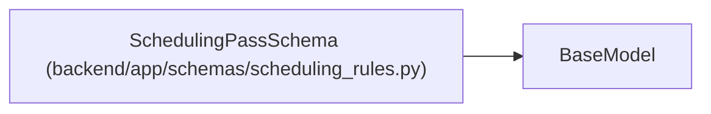

# SchedulingPassSchema

**Location:** `backend/app/schemas/scheduling_rules.py:18`
**Kind:** Pydantic model
**Bases:** `BaseModel`
**Module:** [schemas_scheduling_rules](../modules/schemas_scheduling_rules.md)

## Description

A scheduling pass with filter and sort rules.

## Attributes

| Name | Type | Wire name | Required | Nullable | Default | Constraints | Examples | Description |
|------|------|-----------|----------|----------|---------|-------------|-------------|----------|
| `id` | `str` | `id` | Yes | No | — | min_length=1 | — | Unique identifier for this pass |
| `description` | `str` | `description` | No | No | `''` | — | — | Human-readable description |
| `enabled` | `bool` | `enabled` | No | No | `True` | — | — | Whether this pass is active |
| `filter` | `FilterConfigSchema` | `filter` | No | No | factory: `FilterConfigSchema` | — | — | — |
| `sort` | `list[SortCriterionSchema]` | `sort` | No | No | factory: `list` | — | — | — |

## Methods

*No public methods. Inherits from base classes.*

## Relationships

<!-- Auto-generated relationship summary. Do not edit by hand. -->

### Summary

| Module | Methods | Attributes |
|---|---:|---|
| [schemas_scheduling_rules](../modules/schemas_scheduling_rules.md) | 0 | `description`, `enabled`, `filter`, `id`, `sort` |

### Structure

| Kind | Entity | Module |
|---|---|---|
| Base | `BaseModel` | — |
