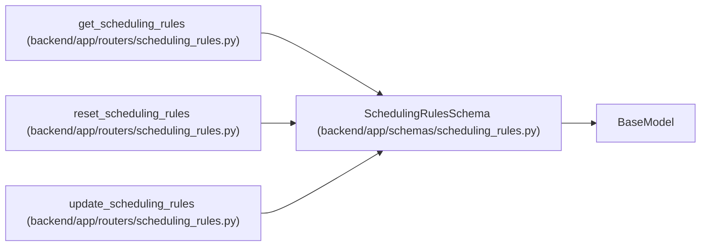

# SchedulingRulesSchema

**Location:** `backend/app/schemas/scheduling_rules.py:53`
**Kind:** Pydantic model
**Bases:** `BaseModel`
**Module:** [schemas_scheduling_rules](../modules/schemas_scheduling_rules.md)

## Description

Complete scheduling rules configuration.

## Model Configuration

| Setting | Value | Source |
|---------|-------|--------|
| `from_attributes` | `True` | config_class |

## Attributes

| Name | Type | Wire name | Required | Nullable | Default | Constraints | Examples | Description |
|------|------|-----------|----------|----------|---------|-------------|-------------|----------|
| `schema_version` | `str` | `schema_version` | No | No | `'1.0'` | — | — | Configuration schema version |
| `effort_modifiers` | `list[EffortModifierSchema]` | `effort_modifiers` | No | No | factory: `list` | — | — | — |
| `scheduling_passes` | `list[SchedulingPassSchema]` | `scheduling_passes` | No | No | factory: `list` | — | — | — |
| `constraints` | `ConstraintsSchema` | `constraints` | No | No | factory: `ConstraintsSchema` | — | — | — |

## Methods

*No public methods. Inherits from base classes.*

## Relationships

<!-- Auto-generated relationship summary. Do not edit by hand. -->

### Summary

| Module | Methods | Attributes |
|---|---:|---|
| [schemas_scheduling_rules](../modules/schemas_scheduling_rules.md) | 0 | `constraints`, `effort_modifiers`, `scheduling_passes`, `schema_version` |

### Structure

| Kind | Entity | Module |
|---|---|---|
| Base | `BaseModel` | — |

### References

| Reference | Kind | Source | Call sites |
|---|---|---|---:|
| `get_scheduling_rules` | call | [routers_scheduling_rules](../modules/routers_scheduling_rules.md) | 1 |
| `reset_scheduling_rules` | call | [routers_scheduling_rules](../modules/routers_scheduling_rules.md) | 1 |
| `update_scheduling_rules` | type_reference | [routers_scheduling_rules](../modules/routers_scheduling_rules.md) | — |
