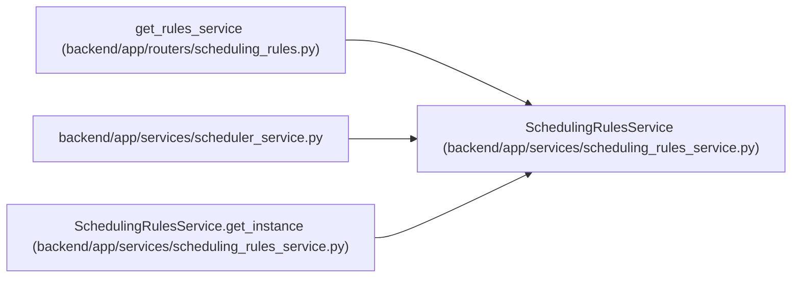

# SchedulingRulesService

**Location:** `backend/app/services/scheduling_rules_service.py:83`
**Kind:** Class
**Bases:** —
**Module:** [scheduling_rules_service](../modules/scheduling_rules_service.md)

## Description

Service for loading and evaluating scheduling rules from YAML.

## Attributes

| Name | Type | Default | Description |
|------|------|---------|-------------|
| `_instance` | `'Optional[SchedulingRulesService]'` | `None` | — |
| `_rules` | `Optional[SchedulingRules]` | `None` | — |

## Methods

| Method | Signature | Decorators | Description |
|--------|-----------|------------|-------------|
| `__init__` | `(config_path: Optional[Path] = None)` | — | Initialize the service. |
| `get_instance` | `(config_path: Optional[Path] = None) -> 'SchedulingRulesService'` | `@classmethod` | Get singleton instance. |
| `reset_instance` | `()` | `@classmethod` | Reset singleton (for testing). |
| `_load_rules` | `() -> None` | — | Load rules from YAML file. |
| `_parse_rules` | `(data: dict) -> SchedulingRules` | — | Parse YAML data into SchedulingRules. |
| `rules` | `() -> Optional[SchedulingRules]` | `@property` | Get loaded rules. |
| `has_rules` | `() -> bool` | `@property` | Check if rules are loaded. |
| `get_constraints` | `() -> Constraints` | — | Get constraints, with defaults if no rules loaded. |
| `get_rules_as_dict` | `() -> dict` | — | Convert current rules to API-friendly dictionary format. |
| `_get_default_rules_dict` | `() -> dict` | — | Get default rules configuration. |
| `update_rules` | `(data: dict) -> None` | — | Update rules from API data and save to YAML file. |
| `_validate_rules` | `(rules: SchedulingRules) -> None` | — | Validate user-editable rules before persistence or activation. |
| `reset_to_defaults` | `() -> None` | — | Reset scheduling rules to default values. |
| `calculate_adjusted_effort` | `(base_effort: float, professionalism_coefficient: float = 1.0, operational_utilization: float = 0.0) -> int` | — | Calculate adjusted effort using configured modifiers. |
| `_evaluate_formula` | `(formula: str, context: dict) -> float` | — | Evaluate a formula using a compiled AST evaluator. |
| `_get_compiled_formula` | `(formula: str) -> Callable[[dict], float]` | — | Get or compile a formula to a callable function. |
| `get_sort_key_function` | `(pass_id: str, task_context_getter: Callable[[Any], dict]) -> Callable[[Any], tuple]` | — | Get a sort key function for a specific scheduling pass. |
| `matches_pass_filter` | `(pass_id: str, task_context: dict) -> bool` | — | Check if a task matches the filter for a scheduling pass. |
| `_evaluate_condition` | `(condition: str, context: dict) -> bool` | — | Evaluate a filter condition without dynamic code execution. |
| `_parse_condition` | `(condition: str) -> tuple[str, str, Any]` | — | Parse the limited filter condition grammar. |
| `_parse_condition_value` | `(raw_value: str) -> Any` | — | Parse a literal used in a scheduling filter condition. |
| `get_scheduling_passes` | `() -> list[SchedulingPass]` | — | Get all enabled scheduling passes. |

## Relationships

<!-- Auto-generated relationship summary. Do not edit by hand. -->

### Summary

| Module | Methods | Attributes |
|---|---:|---|
| [scheduling_rules_service](../modules/scheduling_rules_service.md) | 22 | `_instance`, `_rules` |

### References

| Reference | Kind | Source | Call sites |
|---|---|---|---:|
| `get_rules_service` | type_reference | [routers_scheduling_rules](../modules/routers_scheduling_rules.md) | — |
| `scheduler_service` | import | [scheduler_service](../modules/scheduler_service.md) | — |
| `SchedulingRulesService.get_instance` | call | [scheduling_rules_service](../modules/scheduling_rules_service.md) | 1 |
| `SchedulingRulesService.get_instance` | type_reference | [scheduling_rules_service](../modules/scheduling_rules_service.md) | — |
