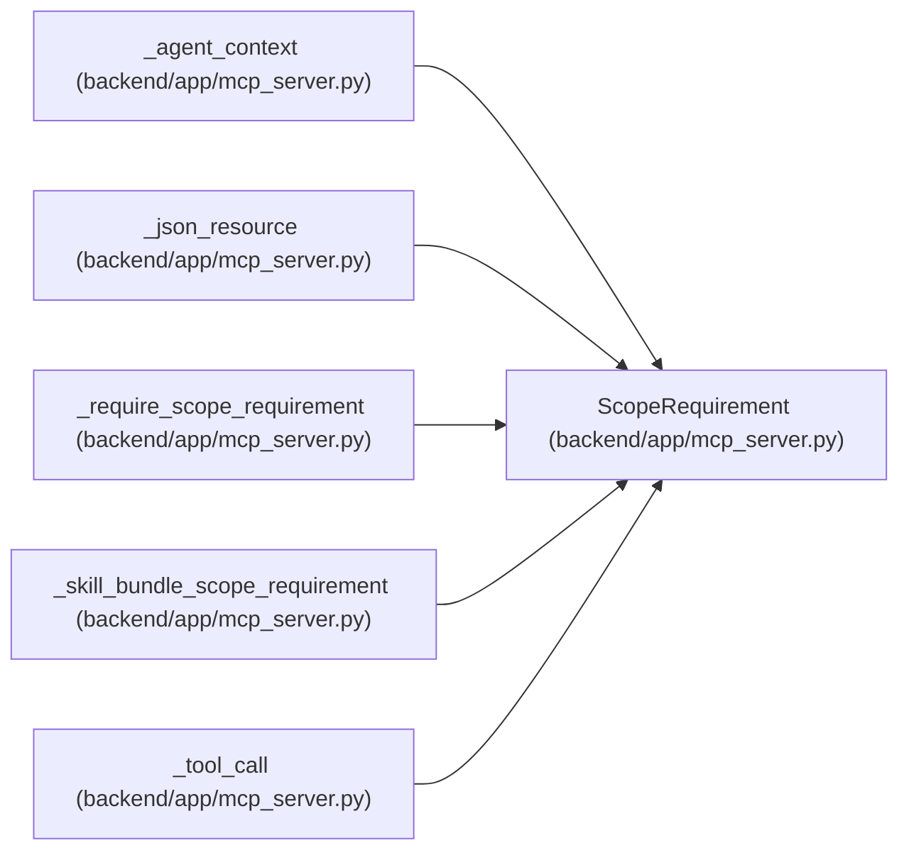

# ScopeRequirement

**Location:** `backend/app/mcp_server.py:197`
**Kind:** Type alias
**Bases:** —
**Module:** [mcp_server](../modules/mcp_server.md)
**Target:** `Optional[str \| tuple[str, ...]]`

## Description

_Auto-generated from `ScopeRequirement` in `backend/app/mcp_server.py`._

## Attributes

*No annotated attributes found.*

## Methods

*No public methods. Inherits from base classes.*

## Relationships

<!-- Auto-generated relationship summary. Do not edit by hand. -->

### Summary

| Module | Methods | Attributes |
|---|---:|---|
| [mcp_server](../modules/mcp_server.md) | 0 | — |

### References

| Reference | Kind | Source | Call sites |
|---|---|---|---:|
| `_agent_context` | type_reference | [mcp_server](../modules/mcp_server.md) | — |
| `_json_resource` | type_reference | [mcp_server](../modules/mcp_server.md) | — |
| `_require_scope_requirement` | type_reference | [mcp_server](../modules/mcp_server.md) | — |
| `_skill_bundle_scope_requirement` | type_reference | [mcp_server](../modules/mcp_server.md) | — |
| `_tool_call` | type_reference | [mcp_server](../modules/mcp_server.md) | — |
