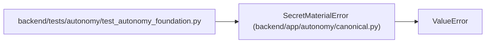

# SecretMaterialError

**Location:** `backend/app/autonomy/canonical.py:102`
**Kind:** Class
**Bases:** `ValueError`
**Module:** [autonomy_canonical](../modules/autonomy_canonical.md)

## Description

Raised when a portable/evidence contract contains credential material.

## Attributes

*No annotated attributes found.*

## Methods

*No public methods. Inherits from base classes.*

## Relationships

<!-- Auto-generated relationship summary. Do not edit by hand. -->

### Summary

| Module | Methods | Attributes |
|---|---:|---|
| [autonomy_canonical](../modules/autonomy_canonical.md) | 0 | — |

### Structure

| Kind | Entity | Module |
|---|---|---|
| Base | `ValueError` | — |

### References

| Reference | Kind | Source | Call sites |
|---|---|---|---:|
| `test_autonomy_foundation` | import | [test_autonomy_foundation](../modules/test_autonomy_foundation.md) | — |
