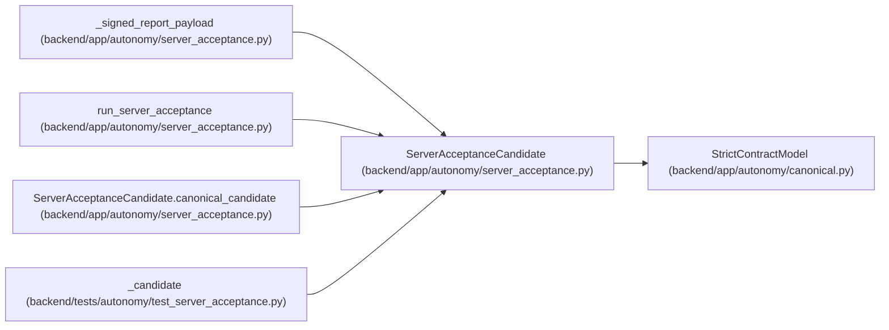

# ServerAcceptanceCandidate

**Location:** `backend/app/autonomy/server_acceptance.py:126`
**Kind:** Pydantic model
**Bases:** `StrictContractModel`
**Module:** [autonomy_server_acceptance](../modules/autonomy_server_acceptance.md)

## Description

_Auto-generated from `ServerAcceptanceCandidate` in `backend/app/autonomy/server_acceptance.py`._

## Validators

| Method | Scope | Fields | Mode | Options |
|--------|-------|--------|------|---------|
| `canonical_candidate` | model | — | after | — |

## Attributes

| Name | Type | Wire name | Required | Nullable | Default | Constraints | Examples | Description |
|------|------|-----------|----------|----------|---------|-------------|-------------|----------|
| `schema_version` | `Literal['workchord-self-hosted-server-candidate-v1']` | `schema_version` | No | No | `'workchord-self-hosted-server-candidate-v1'` | — | — | — |
| `profile` | `Literal['self-hosted-server-v1']` | `profile` | No | No | `'self-hosted-server-v1'` | — | — | — |
| `evidence_scope` | `Literal['self-hosted-server-only']` | `evidence_scope` | No | No | `'self-hosted-server-only'` | — | — | — |
| `evaluated_at` | `datetime` | `evaluated_at` | Yes | No | — | — | — | — |
| `source_revision` | `str` | `source_revision` | Yes | No | — | pattern=unknown (REVISION_PATTERN) | — | — |
| `release_fingerprint` | `str` | `release_fingerprint` | Yes | No | — | pattern=unknown (SHA256_PATTERN) | — | — |
| `contract_manifest_digest` | `str` | `contract_manifest_digest` | Yes | No | — | pattern=unknown (SHA256_PATTERN) | — | — |
| `application` | `ApplicationAcceptance` | `application` | Yes | No | — | — | — | — |
| `signer` | `TransitSignerAcceptance` | `signer` | Yes | No | — | — | — | — |
| `object_store` | `ObjectStoreAcceptance` | `object_store` | Yes | No | — | — | — | — |
| `cas` | `CasAcceptance` | `cas` | Yes | No | — | — | — | — |
| `production_mutation_allowed` | `Literal[False]` | `production_mutation_allowed` | No | No | `False` | — | — | — |
| `accepted_as_production_evidence` | `Literal[False]` | `accepted_as_production_evidence` | No | No | `False` | — | — | — |
| `accepted_as_zero_human_evidence` | `Literal[False]` | `accepted_as_zero_human_evidence` | No | No | `False` | — | — | — |
| `production_autonomy_qualified` | `Literal[False]` | `production_autonomy_qualified` | No | No | `False` | — | — | — |
| `production_gates_satisfied` | `Literal[False]` | `production_gates_satisfied` | No | No | `False` | — | — | — |
| `production_program_decision` | `Literal['NO-SHIP']` | `production_program_decision` | No | No | `'NO-SHIP'` | — | — | — |
| `report_digest` | `str` | `report_digest` | Yes | No | — | pattern=unknown (SHA256_PATTERN) | — | — |

## Methods

| Method | Signature | Decorators | Description |
|--------|-----------|------------|-------------|
| `canonical_candidate` | `() -> 'ServerAcceptanceCandidate'` | `@model_validator(mode='after')` | — |

## Relationships

<!-- Auto-generated relationship summary. Do not edit by hand. -->

### Summary

| Module | Methods | Attributes |
|---|---:|---|
| [autonomy_server_acceptance](../modules/autonomy_server_acceptance.md) | 1 | `accepted_as_production_evidence`, `accepted_as_zero_human_evidence`, `application`, `cas`, `contract_manifest_digest`, `evaluated_at`, `evidence_scope`, `object_store`, `production_autonomy_qualified`, `production_gates_satisfied`, `production_mutation_allowed`, `production_program_decision` |

### Structure

| Kind | Entity | Module |
|---|---|---|
| Base | `StrictContractModel` | [autonomy_canonical](../modules/autonomy_canonical.md) |

### References

| Reference | Kind | Source | Call sites |
|---|---|---|---:|
| `_signed_report_payload` | type_reference | [autonomy_server_acceptance](../modules/autonomy_server_acceptance.md) | — |
| `run_server_acceptance` | call | [autonomy_server_acceptance](../modules/autonomy_server_acceptance.md) | 1 |
| `ServerAcceptanceCandidate.canonical_candidate` | type_reference | [autonomy_server_acceptance](../modules/autonomy_server_acceptance.md) | — |
| `_candidate` | call | [test_server_acceptance](../modules/test_server_acceptance.md) | 1 |
| `_candidate` | type_reference | [test_server_acceptance](../modules/test_server_acceptance.md) | — |
