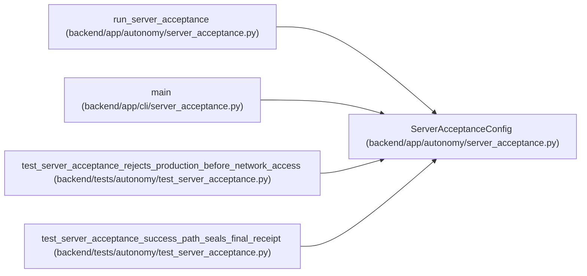

# ServerAcceptanceConfig

**Location:** `backend/app/autonomy/server_acceptance.py:289`
**Kind:** Class
**Bases:** —
**Module:** [autonomy_server_acceptance](../modules/autonomy_server_acceptance.md)

**Decorators:** `@dataclass(frozen=True)`

## Description

Runtime inputs, including credentials that never enter a receipt.

## Attributes

| Name | Type | Default | Description |
|------|------|---------|-------------|
| `deployment_environment` | `str` | *required* | — |
| `backend_url` | `str` | *required* | — |
| `gateway_url` | `str` | *required* | — |
| `signer_url` | `str` | *required* | — |
| `signer_token` | `str` | *required* | — |
| `signer_key` | `str` | *required* | — |
| `trusted_signer_public_key_base64` | `str` | *required* | — |
| `object_store_url` | `str` | *required* | — |
| `object_store_access_key` | `str` | *required* | — |
| `object_store_secret_key` | `str` | *required* | — |
| `object_store_bucket` | `str` | *required* | — |
| `object_store_region` | `str` | *required* | — |
| `valkey_host` | `str` | *required* | — |
| `valkey_port` | `int` | *required* | — |
| `timeout_seconds` | `float` | `10.0` | — |

## Methods

*No public methods. Inherits from base classes.*

## Relationships

<!-- Auto-generated relationship summary. Do not edit by hand. -->

### Summary

| Module | Methods | Attributes |
|---|---:|---|
| [autonomy_server_acceptance](../modules/autonomy_server_acceptance.md) | 0 | `backend_url`, `deployment_environment`, `gateway_url`, `object_store_access_key`, `object_store_bucket`, `object_store_region`, `object_store_secret_key`, `object_store_url`, `signer_key`, `signer_token`, `signer_url`, `timeout_seconds` |

### References

| Reference | Kind | Source | Call sites |
|---|---|---|---:|
| `run_server_acceptance` | type_reference | [autonomy_server_acceptance](../modules/autonomy_server_acceptance.md) | — |
| `main` | call | [cli_server_acceptance](../modules/cli_server_acceptance.md) | 1 |
| `test_server_acceptance_rejects_production_before_network_access` | call | [test_server_acceptance](../modules/test_server_acceptance.md) | 1 |
| `test_server_acceptance_success_path_seals_final_receipt` | call | [test_server_acceptance](../modules/test_server_acceptance.md) | 1 |
